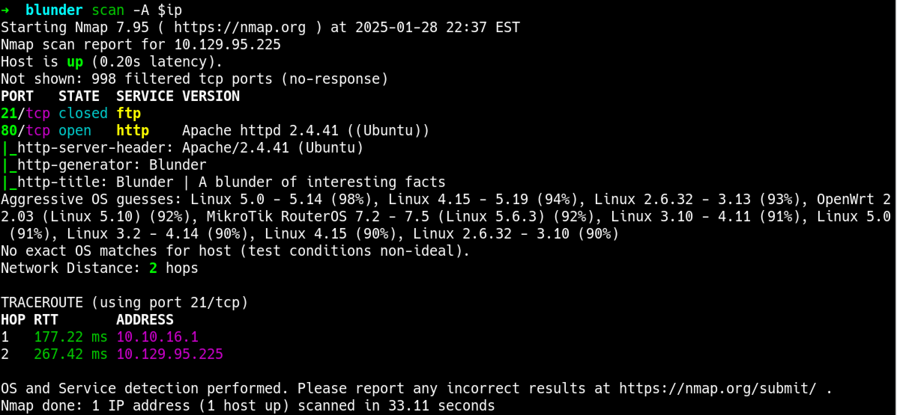
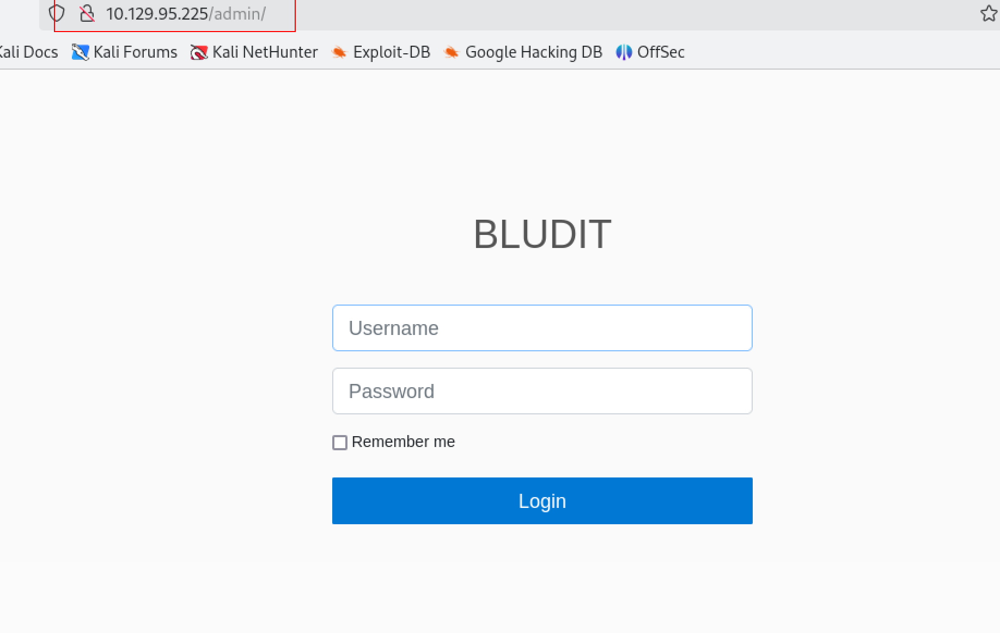
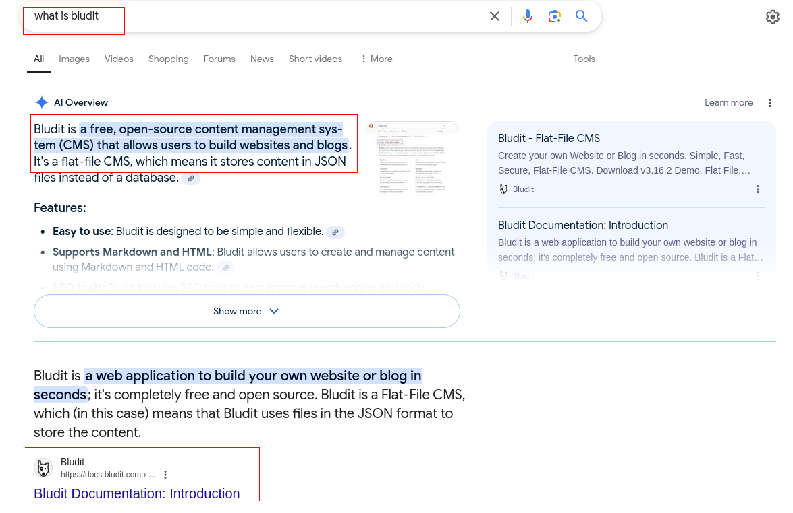

# Blunder Walkthrough
```bash
10.129.95.225
```
### Nmap scan
```bash
```


After visting the front site there is a admin panel on the http://ip/admin 


As we can see the `bludit` is the name of the CMS here. a quick google search will give use a bit more iformation about the CMS hosted on this server. 
