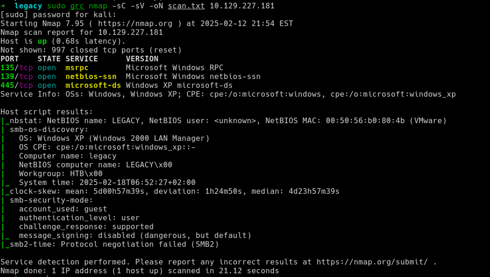
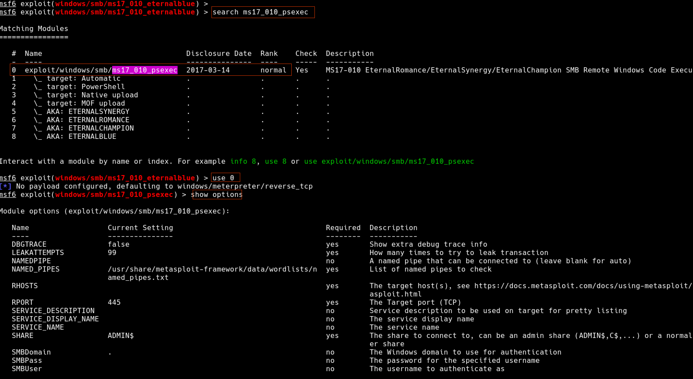
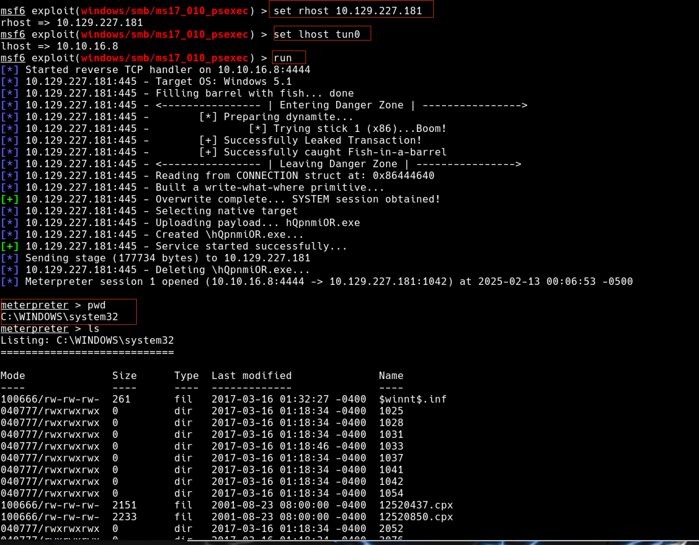
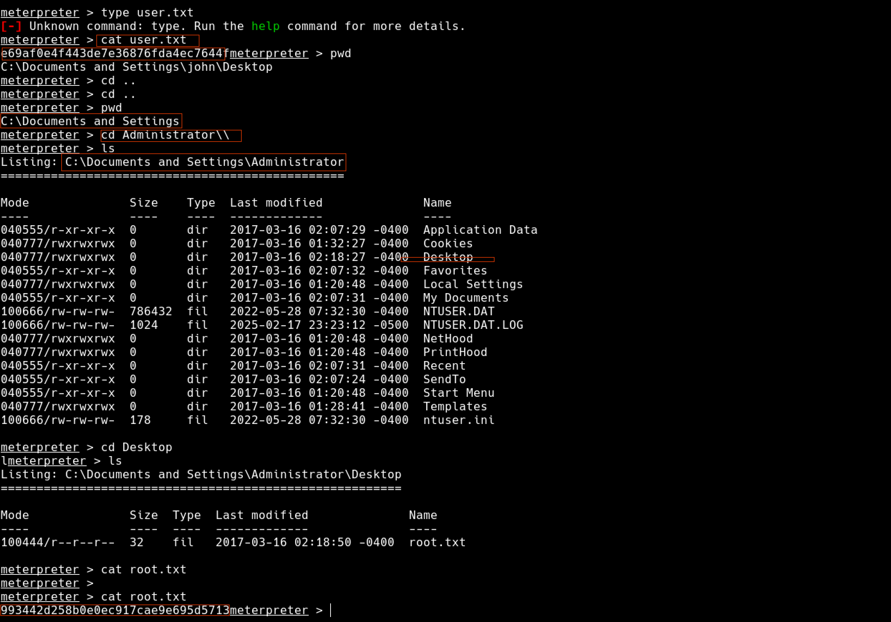

# Legacy

### nmap
```bash
sudo -sC -sV -oN 10.129.227.181
sudo -sC -sV --script=vuln <IP>
```


- 135 RPC
- 139 Netbios
- 445 SMB

## Metasploit 
The easiest way to get root this machine is using the metasploit which will give the root access (system32)


after setting the RHOST and LHOST we can run the exploit.


Access the user.txt and root.txt flags for summisions

