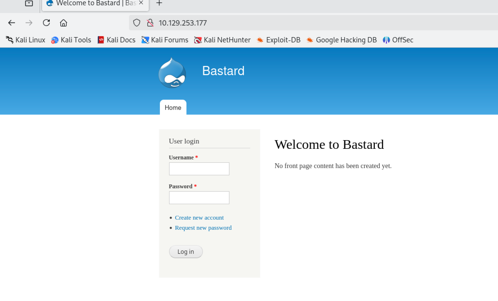
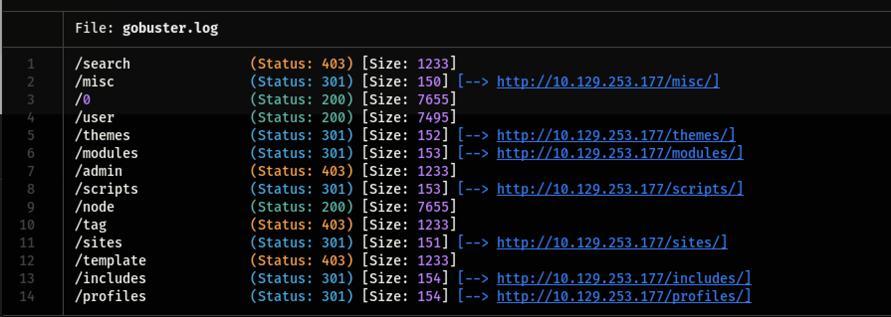

# Bastared

## Nmap
```bash
nmap -sV -sC -oG nmap <ip>
```
```bash hl_lines="6 17 18"
Starting Nmap 7.95 ( https://nmap.org ) at 2025-02-23 01:27 EST
Nmap scan report for 10.129.253.177
Host is up (0.11s latency).
Not shown: 997 filtered tcp ports (no-response)
PORT      STATE SERVICE VERSION
80/tcp    open  http    Microsoft IIS httpd 7.5
| http-robots.txt: 36 disallowed entries (15 shown)
| /includes/ /misc/ /modules/ /profiles/ /scripts/ 
| /themes/ /CHANGELOG.txt /cron.php /INSTALL.mysql.txt 
| /INSTALL.pgsql.txt /INSTALL.sqlite.txt /install.php /INSTALL.txt 
|_/LICENSE.txt /MAINTAINERS.txt
|_http-generator: Drupal 7 (http://drupal.org)
|_http-title: Welcome to Bastard | Bastard
|_http-server-header: Microsoft-IIS/7.5
| http-methods: 
|_  Potentially risky methods: TRACE
135/tcp   open  msrpc   Microsoft Windows RPC
49154/tcp open  msrpc   Microsoft Windows RPC
Service Info: OS: Windows; CPE: cpe:/o:microsoft:windows
```
### Port 80
Visiting the port `80` has a website running with login page.


### Gobuster

