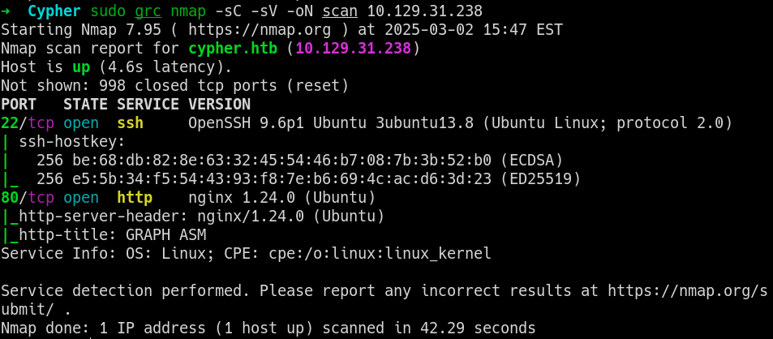
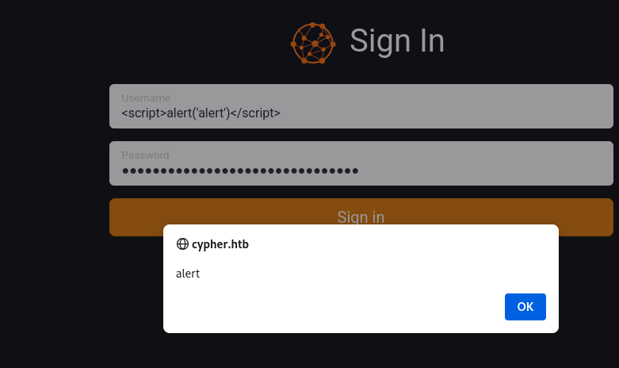

# Cypher -- linux box

### nmap

```bash
nmap -sV -sC -oA scan 10.129.31.238
```


## Gobuster

After runing gobuster found a few quick directories and exploring, I found a .jar file on the `/testing` directory.
`http://cypher.htb/testing` -> `custom-apoc-extension-1.0-SNAPSHOT.jar`
The jar file can be read with `vim`

```bash
META-INF/
META-INF/MANIFEST.MF
com/
com/cypher/
com/cypher/neo4j/
com/cypher/neo4j/apoc/
com/cypher/neo4j/apoc/CustomFunctions$StringOutput.class
com/cypher/neo4j/apoc/HelloWorldProcedure.class
com/cypher/neo4j/apoc/CustomFunctions.class
com/cypher/neo4j/apoc/HelloWorldProcedure$HelloWorldOutput.class
META-INF/maven/
META-INF/maven/com.cypher.neo4j/
META-INF/maven/com.cypher.neo4j/custom-apoc-extension/
META-INF/maven/com.cypher.neo4j/custom-apoc-extension/pom.xml
META-INF/maven/com.cypher.neo4j/custom-apoc-extension/pom.properties
```

## Testing feew things, Looks like the site is vulnerable to cross site scripting
As I entered `<script>alert('alert')</script>` I get the dialog box back which means this site is vulnerable to crossite scripting. let's dig deeper.
